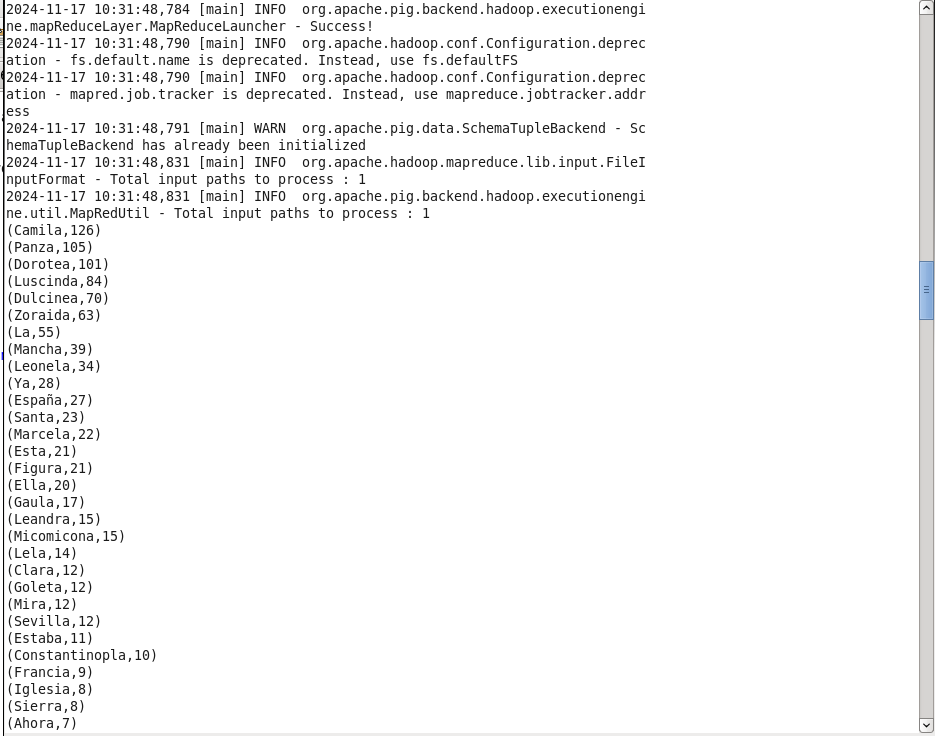

## Codi
```
-- Carregar el fitxer
data = LOAD 'quijote.txt' USING PigStorage('\n') AS (line:chararray);

-- Dividir les línies en paraules
words = FOREACH data GENERATE FLATTEN(TOKENIZE(line)) AS word;

-- Filtrar paraules que comencin amb majúscula i acabin amb "a"
filtered_words = FILTER words BY word MATCHES '^[A-Z].*a$';

-- Comptar les ocurrències de cada paraula
grouped_words = GROUP filtered_words BY word;
word_counts = FOREACH grouped_words GENERATE
    group AS word,
    COUNT(filtered_words) AS count;

-- Ordenar per ocurrències (descendent) i després alfabèticament
ordered_words = ORDER word_counts BY count DESC, word ASC;

-- Mostrar el resultat
DUMP ordered_words;
```

## Explicacio

Executam `pig apartat1.pig` al directori on tenim els arxius apartata1.pig amb el codi i el quijote.txt obtingut per wget



Output complet:

```
(Camila,126)
(Panza,105)
(Dorotea,101)
(Luscinda,84)
(Dulcinea,70)
(Zoraida,63)
(La,55)
(Mancha,39)
(Leonela,34)
(Ya,28)
(España,27)
(Santa,23)
(Marcela,22)
(Esta,21)
(Figura,21)
(Ella,20)
(Gaula,17)
(Leandra,15)
(Micomicona,15)
(Lela,14)
(Clara,12)
(Goleta,12)
(Mira,12)
(Sevilla,12)
(Estaba,11)
(Constantinopla,10)
(Francia,9)
(Iglesia,8)
(Sierra,8)
(Ahora,7)
(Córdoba,7)
(Decía,7)
(Era,7)
(Mantua,7)
(Borgoña,6)
(García,6)
(Hircania,6)
(Morena,6)
(Para,6)
(Torralva,6)
(Traía,6)
(Aldonza,5)
(Andalucía,5)
(Babieca,5)
(Berbería,5)
(Grecia,5)
(Quijada,5)
(Tenía,5)
(Diana,4)
(Escritura,4)
(Extremadura,4)
(Fortuna,4)
(Fosca,4)
(Ginebra,4)
(Había,4)
(Inglaterra,4)
(Juana,4)
(Madásima,4)
(Mallorca,4)
(Málaga,4)
(Nuestra,4)
(Osuna,4)
(Quisiera,4)
(Segovia,4)
(Valencia,4)
(Venga,4)
(Venía,4)
(Viedma,4)
(Vista,4)
(Acaba,3)
(Admirada,3)
(Angélica,3)
(Aquella,3)
(Calla,3)
(Castilla,3)
(Cosa,3)
(Desta,3)
(Ea,3)
(Esa,3)
(Granada,3)
(Hasta,3)
(Historia,3)
(Iba,3)
(Ingalaterra,3)
(Mahoma,3)
(Novela,3)
(Nunca,3)
(Peña,3)
(Quintañona,3)
(Redonda,3)
(Roca,3)
(Salamanca,3)
(Sarra,3)
(Señora,3)
(Tabla,3)
(Toda,3)
(Urganda,3)
(Alcántara,2)
(Alemania,2)
(Andaba,2)
(Andrea,2)
(Arabia,2)
(Austria,2)
(África,2)
(Baeza,2)
(Barba,2)
(Basilea,2)
(Bretaña,2)
(Cada,2)
(Calatrava,2)
(Desa,2)
(Escucha,2)
(Espada,2)
(Europa,2)
(Fuera,2)
(Guadiana,2)
(Guardábala,2)
(Guevara,2)
(Hablara,2)
(Jaramilla,2)
(Llegada,2)
(Loba,2)
(Lucrecia,2)
(Magalona,2)
(Manchada,2)
(María,2)
(Molinera,2)
(Nueva,2)
(Olalla,2)
(Oriana,2)
(Papa,2)
(Parapilla,2)
(Persia,2)
(Quesada,2)
(Saavedra,2)
(Sacra,2)
(Ta,2)
(Tobosa,2)
(Tracia,2)
(Trapisonda,2)
(Troya,2)
(Una,2)
(Venecia,2)
(Abrazóla,1)
(Abrila,1)
(Aconsejaba,1)
(Advierta,1)
(Alba,1)
(Albraca,1)
(Alcarria,1)
(Alejandría,1)
(Alguna,1)
(Alojaba,1)
(América,1)
(Antequera,1)
(Apuróla,1)
(Araucana,1)
(Arcadia,1)
(Armenia,1)
(Asia,1)
(Astrología,1)
(Audiencia,1)
(Austríada,1)
(Avila,1)
(Azpeitia,1)
(Barbarroja,1)
(Basta,1)
(Bella,1)
(Belona,1)
(Bienaya,1)
(Buena,1)
(Caba,1)
(Carcajona,1)
(Carolea,1)
(Cartagena,1)
(Casa,1)
(Cataluña,1)
(Catilina,1)
(Cava,1)
(Cerca,1)
(Considera,1)
(Consideraba,1)
(Corría,1)
(Cortada,1)
(Creta,1)
(Cualquiera,1)
(Cuanta,1)
(Cuelga,1)
(Cuenta,1)
(Culpa,1)
(Daraida,1)
(Darásela,1)
(Deja,1)
(Dejáronla,1)
(Demasiada,1)
(Desconcierta,1)
(Deseaba,1)
(Desmentíla,1)
(Diera,1)
(Dinamarca,1)
(Elena,1)
(Enamoróla,1)
(Encerrada,1)
(Enemiga,1)
(Entendida,1)
(Escuchóla,1)
(Espantada,1)
(Estándola,1)
(Etiopía,1)
(Fama,1)
(Fecha,1)
(Felicia,1)
(Florencia,1)
(Fonseca,1)
(Frisaba,1)
(Gaeta,1)
(Galatea,1)
(Garaya,1)
(Génova,1)
(Gonela,1)
(Guadalajara,1)
(Guinea,1)
(Hacía,1)
(Haga,1)
(Hamida,1)
(Hecha,1)
(Iberia,1)
(Importa,1)
(India,1)
(Insula,1)
(Isabela,1)
(Italia,1)
(Jarifa,1)
(Limpia,1)
(Llegaba,1)
(Llevara,1)
(Lombardia,1)
(Luna,1)
(Machuca,1)
(Magimasa,1)
(Mala,1)
(Maldecía,1)
(Malindrania,1)
(Malta,1)
(Maria,1)
(Mata,1)
(Medusa,1)
(Mentironiana,1)
(Meona,1)
(Miaulina,1)
(Miraguarda,1)
(Mirábala,1)
(Mirándola,1)
(Mucha,1)
(Murcia,1)
(Negra,1)
(Nervia,1)
(Ninfa,1)
(Ninguna,1)
(Numancia,1)
(Oliva,1)
(Oria,1)
(Otomana,1)
(Otra,1)
(Palía,1)
(Pasa,1)
(Pasaba,1)
(Pata,1)
(Pedía,1)
(Pintiquiniestra,1)
(Pisuerga,1)
(Placerdemivida,1)
(Porcia,1)
(Presa,1)
(Presupuesta,1)
(Procura,1)
(Procuraba,1)
(Prosupuesta,1)
(Quería,1)
(Querría,1)
(Quitañona,1)
(Rastrea,1)
(Reposa,1)
(Reposada,1)
(Resta,1)
(Rochela,1)
(Roma,1)
(Rumía,1)
(Salía,1)
(Sea,1)
(Segunda,1)
(Sepa,1)
(Servía,1)
(Sigüenza,1)
(Sila,1)
(Soberana,1)
(Sobradisa,1)
(Suba,1)
(Tabarca,1)
(Teníala,1)
(Teresa,1)
(Tesalia,1)
(Tierra,1)
(Tolosa,1)
(Tomóla,1)
(Tornóla,1)
(Toscana,1)
(Ubeda,1)
(Urbina,1)
(Venida,1)
(Viola,1)
(Viva,1)
(Vivía,1)
(Vizcaya,1)
(Volviéronla,1)
(Vuestra,1)
(Zanoguera,1)
(Zaragoza,1)
(Zulema,1)
```

