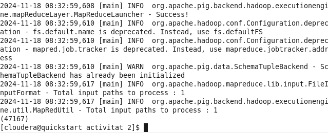
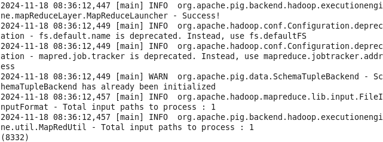
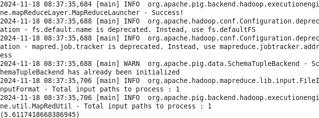
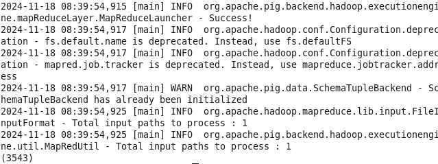
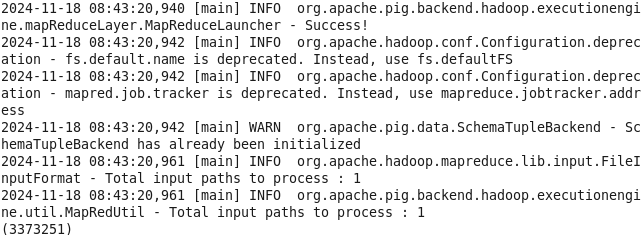
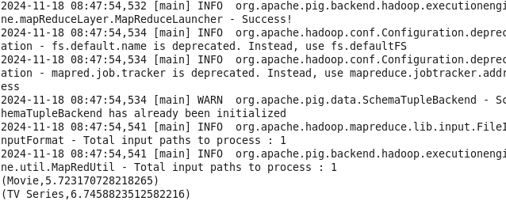
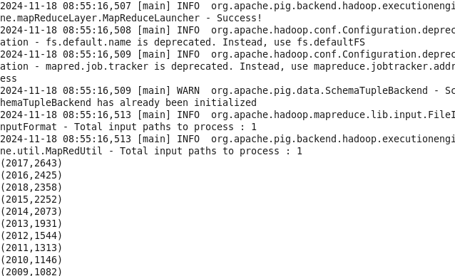
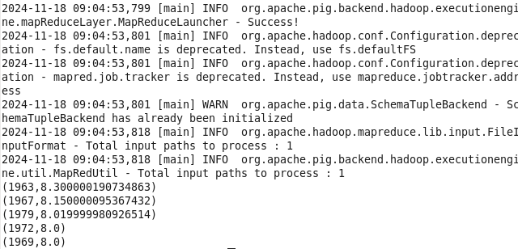
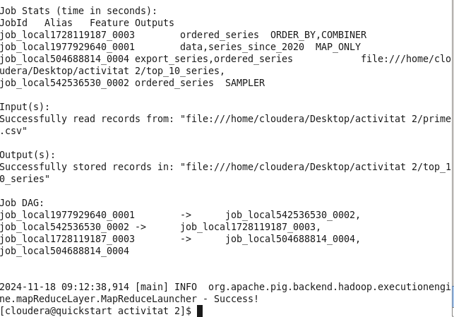
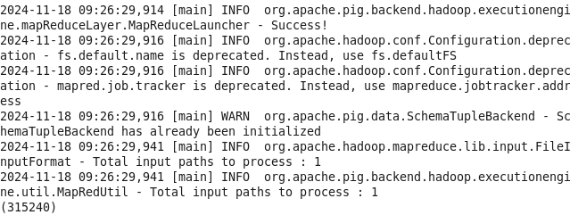

## Apartat 2

```
data = LOAD 'prime.csv' USING PigStorage(',') 
    AS (url:chararray, title:chararray, type:chararray, genres:chararray, 
        releaseYear:float, imdbId:chararray, imdbAverageRating:float, 
        imdbNumVotes:int, availableCountries:chararray);

filtered_data = FILTER data BY releaseYear IS NOT NULL;
```

Despres de investigar per que no acabava de anar be el load, vaig demanar als companys de clase perque m'ajudassin, aixi que tendrem el load igual:

```
REGISTER /usr/lib/pig/piggybank.jar;

-- Leer archivo
data = LOAD 'prime.csv' USING org.apache.pig.piggybank.storage.CSVExcelStorage(
  ',', 'NO_MULTILINE', 'UNIX', 'SKIP_INPUT_HEADER' )
 AS (
    url: chararray,
    title: chararray,
    type:chararray,
    genres:chararray,
    releaseYear: int,
    imdbId:chararray,
    imdbAverageRating: float,
    imdbNumVotes: int,
    availableCountries: chararray
);
```

1. nombre total de files de dades excloent la capcalera
```
grouped_data = GROUP data ALL;
total_rows = FOREACH grouped_data GENERATE COUNT(data);

DUMP total_rows;
```


2. Nombre de series
```
series = FILTER filtered_data BY type == 'TV Series';
total_series = FOREACH (GROUP series ALL) GENERATE COUNT(series) AS total;
DUMP total_series;
```


3. Mitjana de valoració IMDb per a pel·lícules de gènere únic "comèdia":
```
comedy_movies = FILTER filtered_data BY type == 'Movie' AND genres == 'Comedy';
average_rating_comedy = FOREACH (GROUP comedy_movies ALL) GENERATE AVG(comedy_movies.imdbAverageRating) AS avg_rating;
DUMP average_rating_comedy;
```


4. Nombre de pel·lícules disponibles a Espanya (ES):
```
movies_in_es = FILTER data BY type == 'Movie' AND availableCountries MATCHES '.*ES.*';
total_movies_es = FOREACH (GROUP movies_in_es ALL) GENERATE COUNT(movies_in_es) AS total;
DUMP total_movies_es;
```


5. Total de vots IMDb de sèries del gènere "ciència-ficció":
```
science_fiction_series = FILTER data BY genres MATCHES '.*Sci-Fi.*' AND type == 'TV Series';
total_votes = FOREACH science_fiction_series GENERATE imdbNumVotes;
total_votes_sum = FOREACH (GROUP total_votes ALL) GENERATE SUM(total_votes);
```


6. Valoració mitjana IMDb de pel·lícules i sèries del 2024 (per separat):
```
data_2024 = FILTER prime_data BY releaseYear == 2024 AND (type == 'Movie' OR type == 'TV Series');
average_imdb_2024 = FOREACH (GROUP data_2024 BY type) GENERATE group AS type, AVG(data_2024.imdbAverageRating) AS avg_imdb_rating;

DUMP average_imdb_2024;
```


7. Els 10 anys amb més pel·lícules (ordenats):
```
movies_by_year = FILTER data BY type == 'Movie';
grouped_movies = GROUP movies_by_year BY releaseYear;
count_movies_by_year = FOREACH grouped_movies GENERATE group AS year, COUNT(movies_by_year) AS total_movies;

ordered_movies_by_year = ORDER count_movies_by_year BY total_movies DESC;
top_10_years = LIMIT ordered_movies_by_year 10;
DUMP top_10_years;
```


8. Els 5 anys amb millor valoració mitjana IMDb per a sèries de drama:
```
drama_series = FILTER data BY type == 'TV Series' AND genres MATCHES '.*Drama.*';
grouped_by_year = GROUP drama_series BY releaseYear;
average_rating_by_year = FOREACH grouped_by_year GENERATE group AS year, AVG(drama_series.imdbAverageRating) AS avg_rating;
sorted_by_rating = ORDER average_rating_by_year BY avg_rating DESC;
top_5_years = LIMIT sorted_by_rating 5;
```


9. Exportar sèries des del 2020 amb millor valoració:
```
series_since_2020 = FILTER data BY type == 'TV Series' AND releaseYear >= 2020;
ordered_series = ORDER series_since_2020 BY imdbAverageRating DESC;
top_10_series = LIMIT ordered_series 10;
export_series = FOREACH top_10_series GENERATE title, releaseYear, imdbAverageRating, imdbNumVotes;
STORE export_series INTO 'top_10_series' USING PigStorage(',');
```


10. Total de vots IMDb de les sèries del fitxer exportat:
```
loaded_series = LOAD 'output_series_2020_best_rating' USING PigStorage(',') AS (title:chararray, releaseYear:int, imdbAverageRating:float, imdbNumVotes:int);
total_imdb_votes = FOREACH (GROUP loaded_series ALL) GENERATE SUM(loaded_series.imdbNumVotes);

DUMP total_imdb_votes;
```
