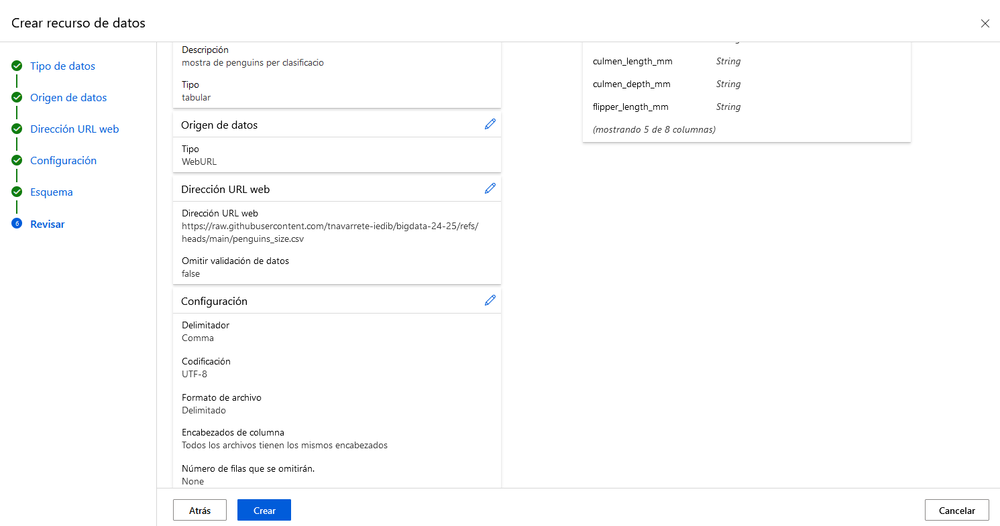
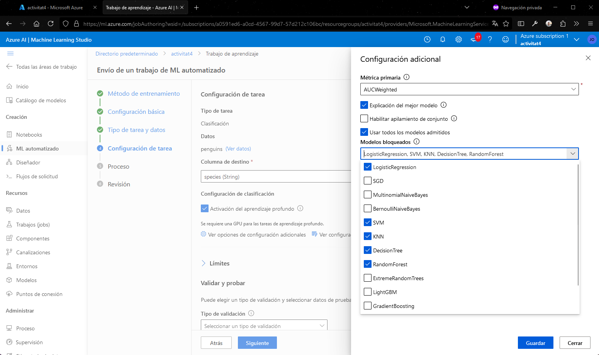
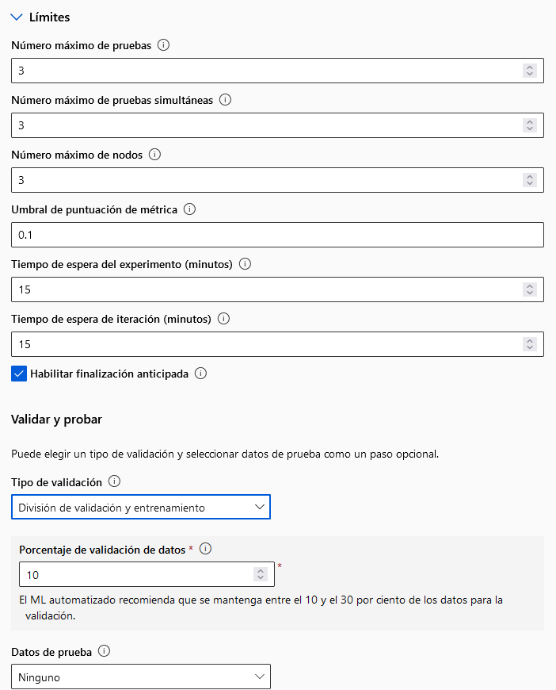
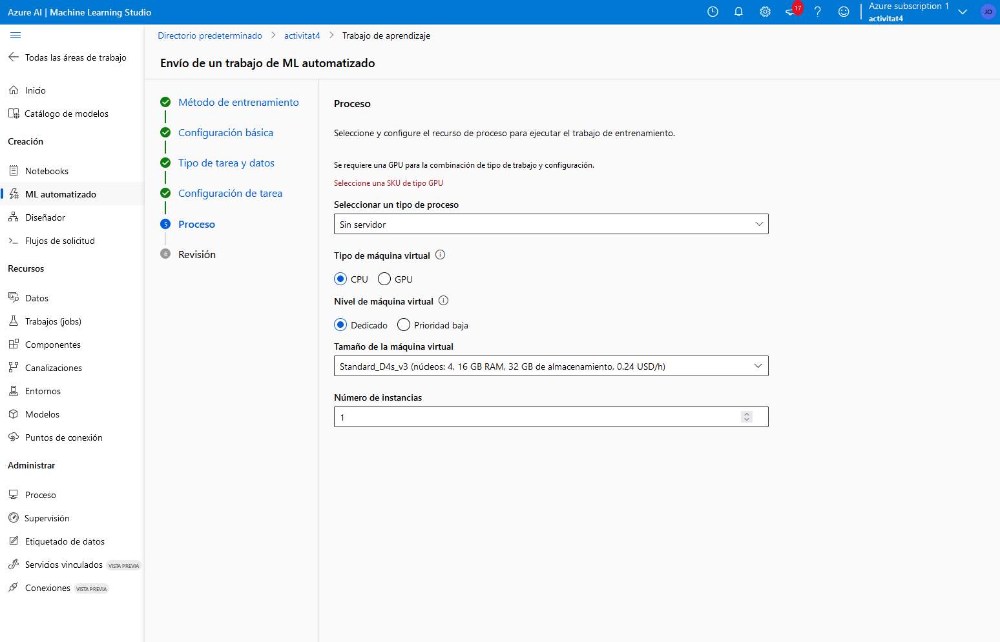
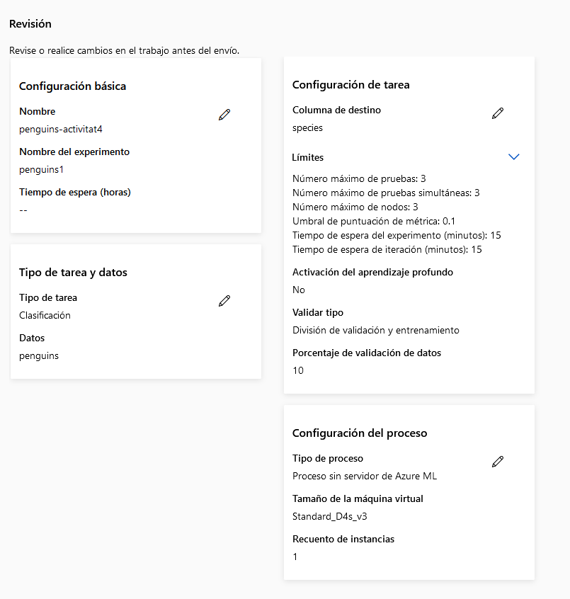
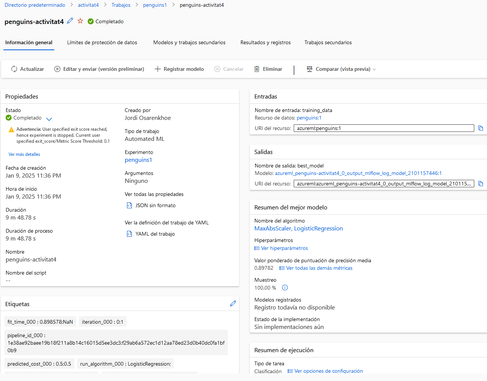
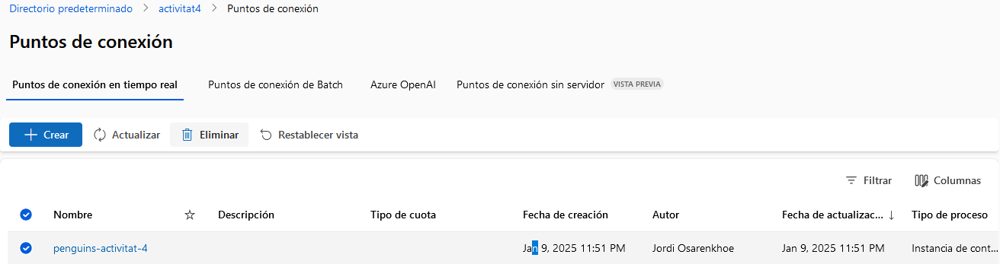

# Pràctica 4: Azure
## Apartat 1: Classificació de pingüins amb Azure Machine Learning
Tornarem a treballar amb un classificador sobre el conjunt de dades dels pingüins de l'arxipèlag Palmer. Recordau que podeu trobar les dades originals a Kaggle (fitxer penguins_size.csv) i una còpia al GitHub del curs.  

Recordem que aquestes són les dades de cada individu: 

    species (variable objectiu, l'espècie de pingüí: Chinstrap, Adélie o Gentoo)
    island (illa: Dream, Torgersen o Biscoe)
    culmen_length_mm (longitud del bec en mm)
    culmen_depth_mm (profunditat del bec en mm)
    flipper_length_mm (longitud de l'aleta en mm)
    body_mass_g (massa corporal en grams)
    sex (sexe: Male o Female)


Per fer-ho, heu de treballar amb Azure Machine Learning amb l'Azure Machine Learning Studio i les funcionalitats de Machine Learning automatitzat, d'una manera semblant a com ho hem fet en el cas pràctic 1 dels apunts. Ara, però, es tracta d'un problema de classificació, no de regressió.

Per fer el treball de ML automatitzat heu d'emprar l'exactitud (accuracy). I heu de considerar els següents models que hem vist en el curs: LogisticRegression, SVM, KNN, DecisionTree i RandomForest. Posau els mateixos límits a l'entrenament dels models que hem emprat en el cas pràctic.

Documenta, incloent-hi explicacions i captures de pantalla, tot el procés, passa a passa. Explica quin és el model que s'ha seleccionat i mostra'n els detalls, incloent-hi els hiperparàmetres i totes les mètriques (amb gràfics). Mostra també la matriu de confusió i comenta-la.

Una vegada tenguis el model, desplega'l en un servei web i envia-li almenys dues peticions de prova, que donin com a resultat flors diferents. Inclou tot això també en la teva documentació. 

Per últim, quan ho hagis acabat tot, elimina tots els recursos. Documenta també aquest procés de neteja.

### Creació del recurs
Després de obtenir la nostra conta de azure, ens dirigim a portal.azure.com i començam a crear un nou recurs. Per fer-ho, seleccionam la opció de crear un recurs i seleccionam Machine Learning o AutoLM.


## Creació del workspace
Després de que s'implementi el recurs, hem de configurar el workspace. Se ha seguit el tutorial donat als recursos del Curs. 


Importarem el dataset de penguins_size.csv per a la classificació mitjançant la url.


Aqui podem observar com se ha importat correctament les dates. De totes maneres, se ha de revisar que les dades siguin correctes.



*image_caption*

<div style="page-break-after: always;" />

### Entrenament del model
Haurem de marcar que volem fer un entrenament per a classificació, i seleccionar les columnes que volem que el model utilitzi per a fer la predicció. Haurem de marcar el tipus de entrenament com classificació i seleccionar la columna que volem predir.


A la seguent passa, seleccionarem els models que volem que s'entrenin. En aquest cas, s'han seleccionat els següents models: 
##### Esta activat el aprenentatge profund, posteriorment s'ha desactivat perque no es podia fer servir amb els models seleccionats sense GPU i se ha possat com Metrica principal la exactitud. Tambe se desactiva Expli



Es configuren els limits com estan especificats a l'enunciat.











Se ha mandat la request des de la meva maquina local, modificant un poc el script perque donava error. El script es el seguent:
```py
import urllib.request
import json
import os
import ssl

def allowSelfSignedHttps(allowed):
    # bypass the server certificate verification on client side
    if allowed and not os.environ.get('PYTHONHTTPSVERIFY', '') and getattr(ssl, '_create_unverified_context', None):
        ssl._create_default_https_context = ssl._create_unverified_context

allowSelfSignedHttps(True) # this line is needed if you use self-signed certificate in your scoring service.

# Request data goes here
# The example below assumes JSON formatting which may be updated
# depending on the format your endpoint expects.
# More information can be found here:
# https://docs.microsoft.com/azure/machine-learning/how-to-deploy-advanced-entry-script
data = {
    "Inputs": {
        "data": [{
            'island': 'Biscoe',
            'culmen_length_mm': 50.0,
            'culmen_depth_mm': 15.0,
            'flipper_length_mm': 220,
            'body_mass_g': 5000,
            'sex': 'Male'
        },
        {
            'island': 'Dream',
            'culmen_length_mm': 35.0,
            'culmen_depth_mm': 17.0,
            'flipper_length_mm': 185,
            'body_mass_g': 3400,
            'sex': 'Female'
        }]
    },
}
        

body = str.encode(json.dumps(data))

url = 'http://a1a2cba1-a1ce-4c2c-b3c7-75b18f73de0b.westeurope.azurecontainer.io/score'
# Replace this with the primary/secondary key, AMLToken, or Microsoft Entra ID token for the endpoint
api_key = '###'
if not api_key:
    raise Exception("A key should be provided to invoke the endpoint")


headers = {'Content-Type':'application/json', 'Authorization':('Bearer '+ api_key)}

req = urllib.request.Request(url, body, headers)

try:
    response = urllib.request.urlopen(req)

    result = response.read()
    print(result)
except urllib.error.HTTPError as error:
    print("The request failed with status code: " + str(error.code))

    # Print the headers - they include the requert ID and the timestamp, which are useful for debugging the failure
    print(error.info())
    print(error.read().decode("utf8", 'ignore'))

```

Amb el resultat:
```py
b'{"Results": ["Gentoo", "Chinstrap"]}'
```





