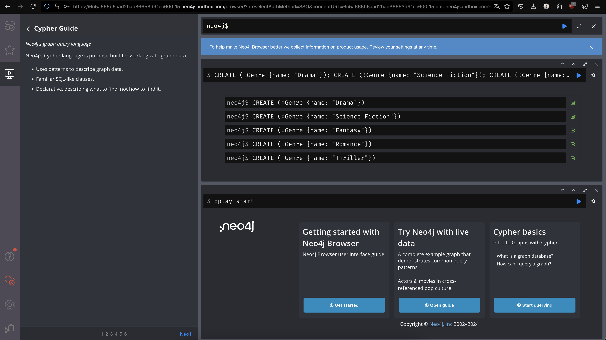
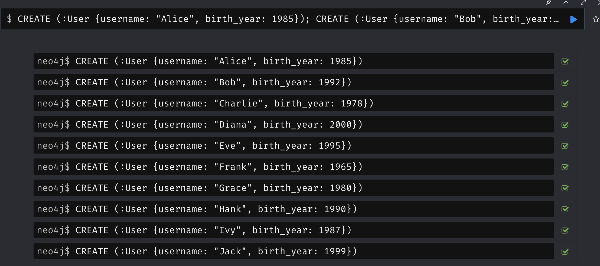
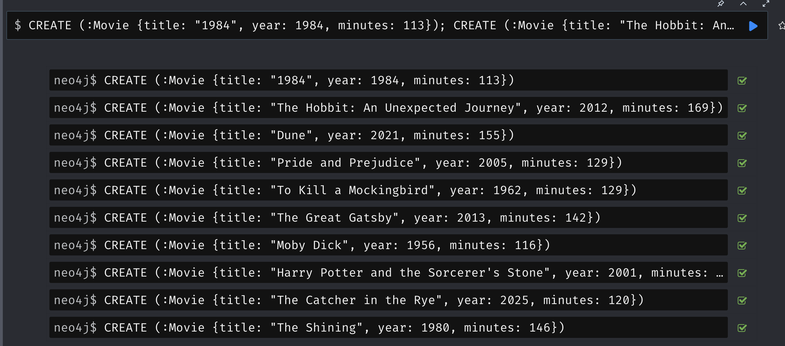
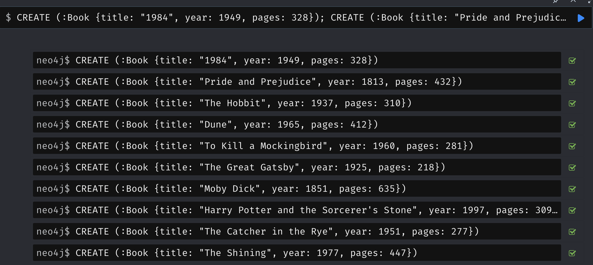

Creacio 


Usuaris


Pelicules


Llibres



- Recupera el títol de tots els llibres.
```
MATCH (b:Book)
RETURN b.title AS book_title;
```
- Tria el nom d'un gènere i recupera el nom dels usuaris que hi estan interessats.
```
MATCH (u:User)-[:INTERESTED_IN]->(g:Genre {name: "Drama"})
RETURN u.username AS user_name;
```
- Recupera el títol dels llibres i pel·lícules del gènere que has triat abans. Indica en cada cas si és un llibre o una pel·lícula.
```
MATCH (n)-[:BELONGS_TO]->(g:Genre {name: "Drama"})
RETURN n.title AS title, labels(n)[0] AS type;
```
- Tria el nom d'un usuari i recupera el títol dels llibres que pertanyen als gèneres que li interessen.
```
MATCH (u:User {username: "Alice"})-[:INTERESTED_IN]->(g:Genre)<-[:BELONGS_TO]-(b:Book)
RETURN b.title AS book_title;
```
- Tria el títol d'un llibre i recupera quina és la mitjana de les seves valoracions.
```
MATCH (b:Book {title: "The Catcher in the Rye"})<-[:REVIEWS]-(r:Review)
RETURN AVG(r.rating) AS average_rating;
```
- Recupera el nom dels usuaris nascuts abans de l'any 1990.
```
MATCH (u:User)
WHERE u.birth_year < 1990
RETURN u.username AS user_name;
```
- Recupera el títol de totes les pel·lícules que estan basades en algun llibre. Mostra també el títol del llibre estan basades cada una d'elles.
```
MATCH (m:Movie)-[:BASED_ON]->(b:Book)
RETURN m.title AS movie_title, b.title AS book_title;
```
- Recupera el títol dels llibres que tenen una valoració de 4 o més.
```
MATCH (b:Book)<-[:REVIEWS]-(r:Review)
WHERE r.rating >= 4
RETURN b.title AS book_title;
```
- Recupera la valoració mitjana de cada gènere (la mitjana del ratings de totes les revisions dels seus llibres i pel·lícules). Mostra-ho ordenat per la valoració mitjana, de major a menor.
```
MATCH (g:Genre)<-[:BELONGS_TO]-(n)-[:REVIEWS]->(r:Review)
RETURN g.name AS genre, AVG(r.rating) AS avg_rating
ORDER BY avg_rating DESC;
```
- Volem fer grups d'usuaris segons la dècada en què han nascut. Recupera la valoració mitjana de cada grup d'edat (els ratings de totes les revisions que han fet els seus usuaris). Mostra-ho ordenat per dècada, de més antiga a més recent.
```
MATCH (u:User)-[:WROTE]->(r:Review)
WITH u, r, u.birth_year / 10 AS decade
RETURN decade * 10 AS decade, AVG(r.rating) AS avg_rating
ORDER BY decade;
```
- Afegeix un nou usuari i una revisió feta per aquest usuari sobre un llibre existent. Dona valor a totes les propietats de l'usuari i de la revisió.
```
CREATE (u:User {username: "Bob", birth_year: 1990 })
CREATE (r:Review {rating: 5, text: "Great book!" })
CREATE (u)-[:WROTE]->(r)
CREATE (r)-[:REVIEWS]->(:Book {title: "The Catcher in the Rye"})
```
- Modifica el nou usuari i la nova revisió, de manera que incrementis en 1 l'any de naixement, i baixis en 1 la valoració (rating).
```
MATCH (u:User {username: "Bob"})-[:WROTE]->(r:Review)
SET u.birth_year = u.birth_year + 1
SET r.rating = r.rating - 1
```
- Elimina l'usuari i la valoració que has creat.
```
MATCH (u:User {username: "Bob"})-[:WROTE]->(r:Review)
DETACH DELETE u, r
```
- Obté un graf GDS amb els nodes dels usuaris i les relacions d'amistat. Tria un usuari i fes un recorregut en amplitud des d'ell, seguint les relacions d'amistat. Fes després un recorregut en profunditat des del mateix node inicial. En ambdós casos, has d'obtenir la ruta sencera.
```
MATCH (u:User)-[:FRIEND_OF*1..3]->(u2:User)
WHERE u.username = "Alice"
RETURN u, u2
```
- Amb el teu graf GDS, tria dos usuaris que no siguin amics i recupera el camí més curt entre ells, emprant les relacions d'amistat, emprant l'algorisme de Dijkstra. 
```
MATCH (u1:User {username: "Alice"}), (u2:User {username: "Bob"})
CALL gds.alpha.shortestPath.dijkstra.stream({
  nodeProjection: 'User',
  relationshipProjection: {
    FRIEND_OF: {
      type: 'FRIEND_OF',
      properties: 'distance',
      orientation: 'UNDIRECTED'
    }
  },
  startNode: u1,
  endNode: u2,
  relationshipWeightProperty: 'distance'
})
```
- Amb el teu graf GDS, determina el grau de sortida (influència) de cada usuari, emprant les relacions d'amistat, ordenats de major a menor.
```
MATCH (u:User)
RETURN u.username AS user_name, SIZE((u)-[:FRIEND_OF]->()) AS out_degree
ORDER BY out_degree DESC;
```
- Amb el teu graf GDS, determina el valor de proximitat (closeness) de cada usuari, emprant les relacions d'amistat, ordenats de major a menor.
```
CALL gds.alpha.closeness.stream({
  nodeProjection: 'User',
  relationshipProjection: {
    FRIEND_OF: {
      type: 'FRIEND_OF',
      orientation: 'UNDIRECTED'
    }
  }
})
YIELD nodeId, centrality
RETURN gds.util.asNode(nodeId).username AS user_name, centrality
ORDER BY centrality DESC;
```
- Amb el teu graf GDS, determina el valor d'intermediació (betweenness) de cada usuari, emprant les relacions d'amistat, ordenats de major a menor.
```
CALL gds.alpha.betweenness.stream({
  nodeProjection: 'User',
  relationshipProjection: {
    FRIEND_OF: {
      type: 'FRIEND_OF',
      orientation: 'UNDIRECTED'
    }
  }
})
YIELD nodeId, centrality
RETURN gds.util.asNode(nodeId).username AS user_name, centrality
ORDER BY centrality DESC;
```
- Determina el nombre de triangles de cada usuari, emprant les relacions d'amistat, ordenats de major a menor nombre. Per fer-ho, abans has de projectar la part necessària del graf a un nou graf GDS no dirigit.
```
CALL gds.graph.create('myGraph', 'User', 'FRIEND_OF')
CALL gds.triangleCount.stream('myGraph')
YIELD nodeId, triangles
RETURN gds.util.asNode(nodeId).username AS user_name, triangles
ORDER BY triangles DESC;
```
- Amb el teu graf original, tria dos usuaris que no siguin amics i determina el nombre de veïnats comú.
```
MATCH (u1:User {username: "Alice"}), (u2:User {username: "Bob"})
RETURN SIZE(apoc.coll.intersection([(u1)-[:FRIEND_OF]->(), (u2)-[:FRIEND_OF]->()])) AS common_neighbors;
```
