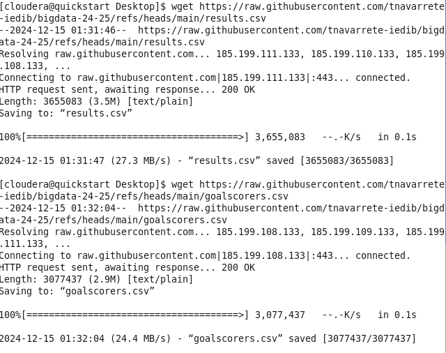
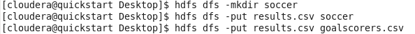
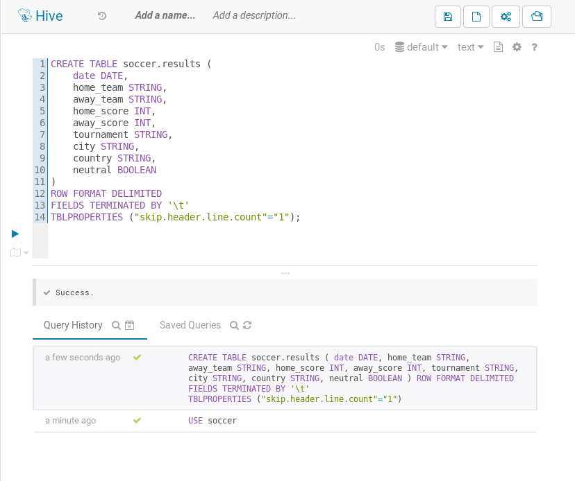
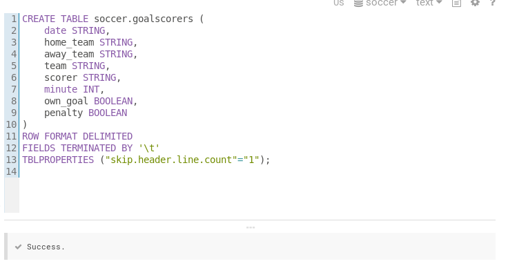
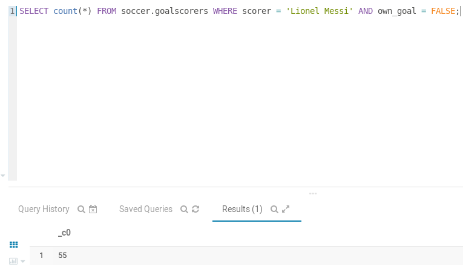
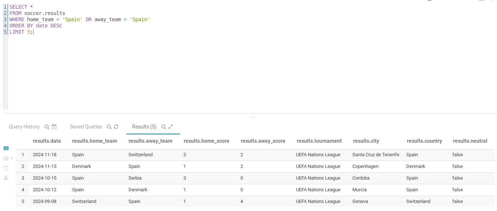
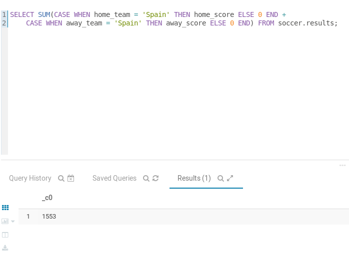
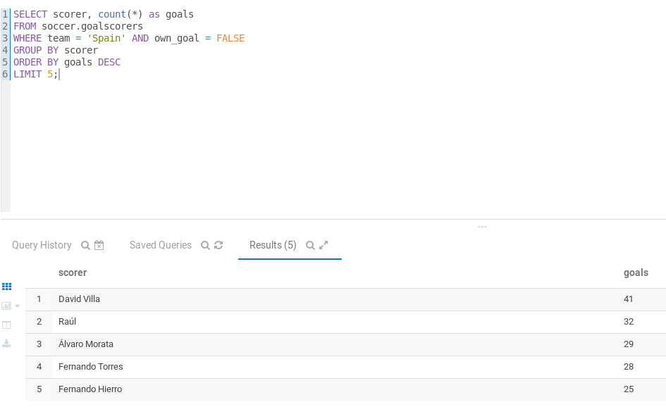
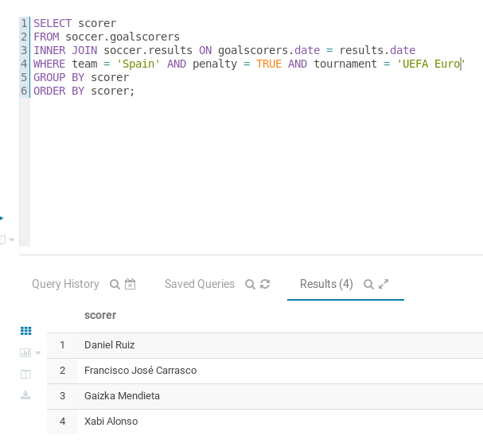
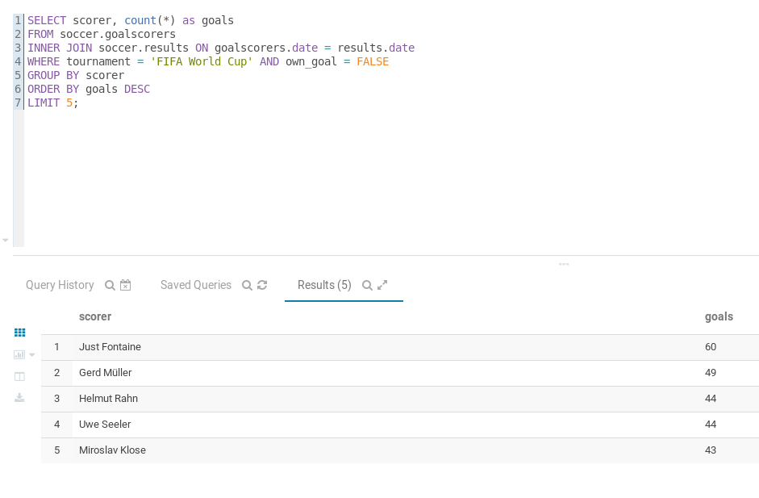

# Arxiu de les captures de pantalla

Obtenim els arxius





Obrim beeline:

`beeline`

```sql
CREATE DATABASE soccer;
USE soccer;
```





# Carregam els csv a les taules

```sql
LOAD DATA LOCAL INPATH "/home/cloudera/Desktop/goalscorers.csv" INTO TABLE soccer.goalscorers;

LOAD DATA LOCAL INPATH "/home/cloudera/Desktop/results.csv" INTO TABLE soccer.results;
```

Ara ja podem comencar a fer consultes:

Nombre de gols que ha marcat en Lionel Messi (sense comptar autogols).
```sql
SELECT count(*) FROM soccer.goalscorers WHERE scorer = 'Lionel Messi' AND own_goal = FALSE;
```


Llistat dels 5 partits més recents que ha jugat la selecció espanyola.
```sql
SELECT * FROM soccer.results
WHERE home_team = 'Spain' OR away_team = 'Spain'
ORDER BY date DESC
LIMIT 5;
```


Nombre de gols que ha marcat Espanya en tota la seva història. Aquesta informació s'ha de treure de results, ja que goalscorers no conté tots els gols.
```sql
SELECT SUM
(CASE WHEN home_team = 'Spain' THEN home_score ELSE 0 END + 
CASE WHEN away_team = 'Spain' THEN away_score ELSE 0 END)
FROM soccer.results;
```


Llistat dels 5 màxims golejadors amb la selecció espanyola (sense comptar autogols).
```sql
SELECT scorer, count(*) as goals
FROM soccer.goalscorers
WHERE team = 'Spain' AND own_goal = FALSE
GROUP BY scorer
ORDER BY goals DESC
LIMIT 5;
```


Llistat dels jugadors espanyols que han marcat algun gol de penal en alguna Eurocopa (UEFA Euro), ordenats alfabèticament.
```sql
SELECT scorer
FROM soccer.goalscorers
INNER JOIN soccer.results ON goalscorers.date = results.date
WHERE team = 'Spain' AND penalty = TRUE AND tournament = 'UEFA Euro'
GROUP BY scorer
ORDER BY scorer;
```


Llistat dels 5 màxims golejadors de les fases finals dels mundials (FIFA World Cup) (sense comptar autogols).
```sql
SELECT scorer, count(*) as goals
FROM soccer.goalscorers
INNER JOIN soccer.results ON goalscorers.date = results.date
WHERE competition LIKE '%FIFA World Cup%' AND own_goal = FALSE
GROUP BY scorer
ORDER BY goals DESC
LIMIT 5;
```

