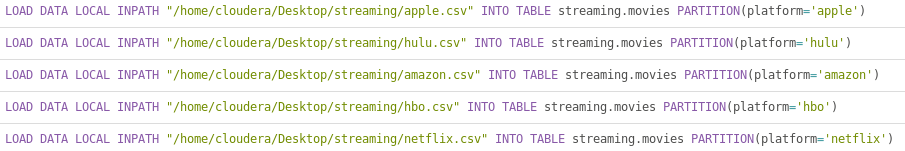
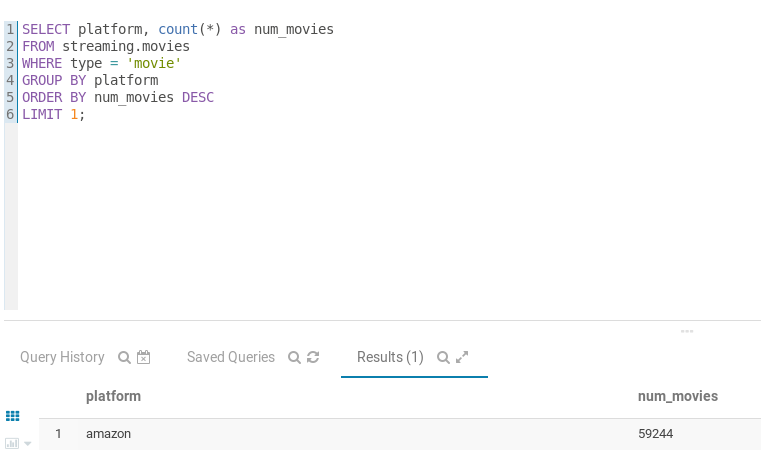
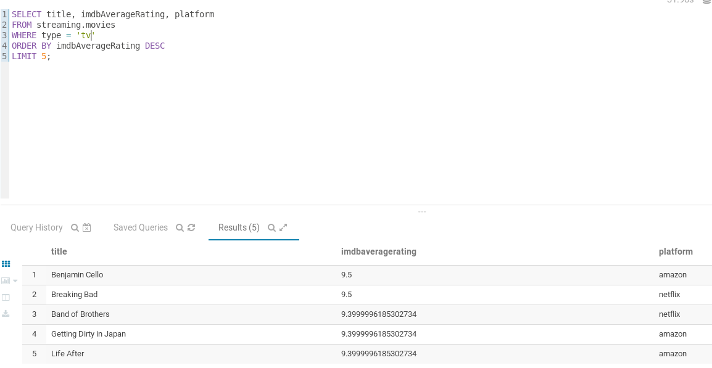
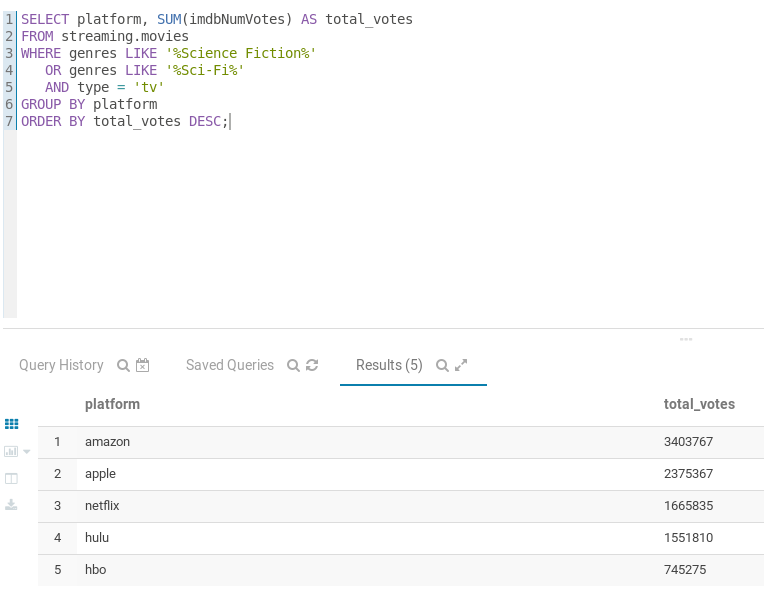
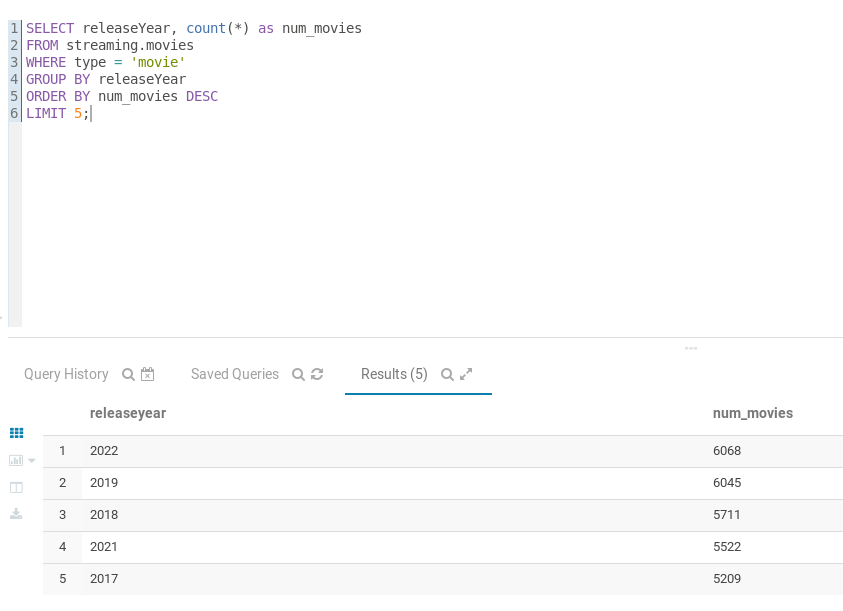

# Apartat 2

```sql
CREATE DATABASE soccer;
USE soccer;
```

```sql
CREATE TABLE streaming.movies (
    title STRING,
    type STRING,
    genres STRING,
    releaseYear FLOAT,
    imdbId STRING,
    imdbAverageRating FLOAT,
    imdbNumVotes INT,
    availableCountries STRING
)
PARTITIONED BY(platform STRING)
ROW FORMAT DELIMITED
FIELDS TERMINATED BY '\t'
TBLPROPERTIES ("skip.header.line.count"="1");
```

Carregam les dades 

```sql
LOAD DATA LOCAL INPATH '/home/cloudera/desktop/streaming/amazon.csv' INTO TABLE streaming.movies
PARTITION(platform = 'amazon');
LOAD DATA LOCAL INPATH '/home/cloudera/desktop/streaming/apple.csv' INTO TABLE streaming.movies
PARTITION(platform = 'apple');
LOAD DATA LOCAL INPATH '/home/cloudera/desktop/streaming/hbo.csv' INTO TABLE streaming.movies
PARTITION(platform = 'hbo');
LOAD DATA LOCAL INPATH '/home/cloudera/desktop/streaming/hulu.csv' INTO TABLE streaming.movies
PARTITION(platform = 'hulu');
LOAD DATA LOCAL INPATH '/home/cloudera/desktop/streaming/netflix.csv' INTO TABLE streaming.movies
PARTITION(platform = 'netflix');
```

1. Quina de les plataformes té més pel·lícules a la seva col·lecció? Mostra la plataforma i el nombre de pel·lícules.
```sql
SELECT platform, count(*) as num_movies
FROM streaming.movies
WHERE type = 'movie'
GROUP BY platform
ORDER BY num_movies DESC
LIMIT 1;
```


2. Quines són les 5 sèries amb millor valoració a IMDB (imdbAverageRating)? Per a cada sèrie, mostra el títol, la valoració i la plataforma on es troba.
```sql
SELECT title, imdbAverageRating, platform
FROM streaming.movies
WHERE type = 'series'
ORDER BY imdbAverageRating DESC
LIMIT 5;
```


3. Quin és el total de vots en IMDB (imdbNumVotes) de totes les sèries del gènere de ciència-ficció en cada una de les plataformes? Per a cada plataforma, mostra la plataforma i el nombre de vots, ordenats de major a menor nombre de vots.
```sql
SELECT platform, SUM(imdbNumVotes) AS total_votes
FROM streaming.movies
WHERE genres LIKE '%Science Fiction%' 
   OR genres LIKE '%Sci-Fi%'
   AND type = 'tv'
GROUP BY platform
ORDER BY total_votes DESC;
```


4. Quins són els 5 anys en què s'han llançat més pel·lícules? Per a cada any, mostra l'any i el nombre de pel·lícules, ordenats de major a menor nombre de pel·lícules.
```sql
SELECT releaseYear, count(*) as num_movies
FROM streaming.movies
WHERE type = 'movie'
GROUP BY releaseYear
ORDER BY num_movies DESC
LIMIT 5;
```
