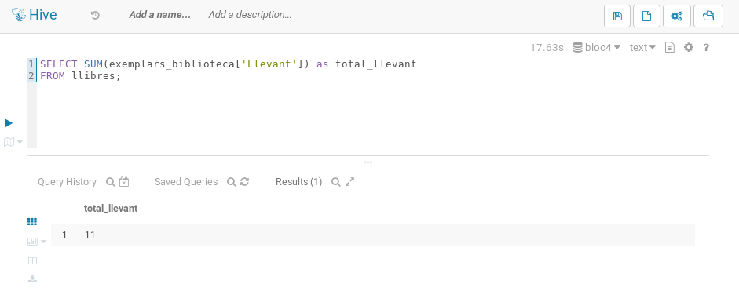

# Practica 4

## Jorge Osarenkhoe Petro

## Objectius

En aquesta pràctica, treballarem amb dades massives utilitzant Apache Hive i Impala. Els objectius principals són:

1. Crear taules externes i carregar dades des de fitxers CSV.
2. Realitzar consultes SQL per extreure informació rellevant de les dades carregades.
3. Treballar amb tipus de dades complexos en Hive.
4. Comparar les diferències entre HiveQL i Impala SQL.
5. Carregar i consultar dades JSON en Hive i Impala.

## Estructura del Document

1. **Creació de les Taules**
    - Descripció de la creació de taules externes en Hive.
    - Scripts SQL per a la creació de taules.

2. **Importació de les Dades**
    - Procediment per importar dades a les taules creades.
    - Scripts SQL per carregar les dades.

3. **Consultes**
    - Consultes SQL per extreure informació de les dades.
    - Resultats de les consultes amb captures de pantalla.

4. **Apartat 1: Movies / TV Shows**
    - Consultes específiques sobre programes de TV i pel·lícules.

5. **Apartat 2: Biblioteques**
    - Creació de taules amb tipus de dades complexos.
    - Consultes sobre llibres i biblioteques.

6. **Apartat 3: Centres Educatius de les Illes Balears**
    - Carrega de dades JSON en Hive.
    - Consultes sobre centres educatius.


## Creacio de les taules

El primer que he fet ha estat investigar un poc els dos fitxers CSV per saber que havia de crear per a que les dades s'importessin correctament. 

```sql
CREATE EXTERNAL TABLE raw_titles (
    index INT,
    id STRING,
    title STRING,
    type STRING,
    release_year STRING,
    age_certification STRING,
    runtime STRING,
    genres STRING,
    production_countries STRING,
    seasons DOUBLE,
    imdb_id STRING,
    imdb_score STRING,
    imdb_votes STRING
)
ROW FORMAT DELIMITED
FIELDS TERMINATED BY ','
STORED AS TEXTFILE
TBLPROPERTIES ('skip.header.line.count'='1');
```

```sql
CREATE EXTERNAL TABLE raw_credits (
    index INT,
    person_id STRING,
    id STRING,
    name STRING,
    character STRING,
    `role` STRING
)
ROW FORMAT DELIMITED
FIELDS TERMINATED BY ','
STORED AS TEXTFILE
TBLPROPERTIES ('skip.header.line.count'='1');
```
##### Vaig cometre un error i vaig asignar tots els numeros com strings, aixi que he hagut de parsejar strings com floats

## Importar les dades
Per importar les dades he fet servir hdfs dfs -put per a pujar els fitxers a HDFS i despres he fet servir la seguent comanda per a importar les dades a les taules:
`hadoop fs -put /home/cloudera/Desktop/raw_titles.csv /user/cloudera/`
`hadoop fs -put /home/cloudera/Desktop/raw_credits.csv /user/cloudera/`

```sql
LOAD DATA INPATH '/user/cloudera/raw_titles.csv' 
OVERWRITE INTO TABLE raw_titles;

LOAD DATA INPATH '/user/cloudera/raw_credits.csv'
OVERWRITE INTO TABLE raw_credits;
```

I per finalitzar la importacio invalido les taules per a que es refresquin les dades:
```sql
INVALIDATE METADATA raw_titles;
INVALIDATE METADATA raw_credits;
```

Despres simplement he fet un SELECT * per a comprovar que les dades s'havien importat correctament.

## Consultes

## Apartat 1: Movies / TV Shows

### 1. Llistat dels 10 programes de TV amb més d'una temporada que tenen millor valoració, ordenats per valoració en ordre decreixent.
```sql
SELECT 
    title,
    seasons,
    imdb_score
FROM raw_titles
WHERE type = 'SHOW' 
    AND seasons > 1
    AND imdb_score != ''
ORDER BY CAST(imdb_score AS FLOAT) DESC
LIMIT 10;
```


### 2. Llistat dels 10 anys en què els seus programes de TV (segons l'any de llançament) han tengut més vots, ordenats per nombre de vots, en ordre decreixent.
```sql
Vaig cometre un error i vaig possar tot els numeros com string, aixi que com consequencia he hagut de parsear strings com floats :)
SELECT 
    release_year,
    SUM(CAST(imdb_votes AS FLOAT)) as total_votes
FROM raw_titles
WHERE type = 'SHOW' 
    AND imdb_votes != ''
GROUP BY release_year
ORDER BY total_votes DESC
LIMIT 10;
```


### 3. Llistat dels 10 directors amb més pel·lícules, ordenats per nombre de pel·lícules en ordre decreixent.
```sql
SELECT 
    c.name,
    COUNT(*) as movie_count
FROM raw_credits c
JOIN raw_titles t ON c.id = t.id
WHERE c.`role` = 'DIRECTOR'
    AND t.type = 'MOVIE'
GROUP BY c.name
ORDER BY movie_count DESC
LIMIT 10;
```


### 4. Llistat dels 10 actors amb millor valoració mitjana de les seves pel·lícules, ordentats per valoració mitjana en ordre decreixent.

En aquesta consulta he hagut de fer servir un HAVING COUNT(*) >= 5 per a que nomes es mostrin els actors que han participat en 5 o mes pel·lícules. Igualment he fet una altra consulta sense el HAVING COUNT(*) >= 5 per a comparar els resultats.

```sql
SELECT 
    c.name,
    AVG(CAST(t.imdb_score AS FLOAT)) as avg_rating,
    COUNT(*) as movie_count
FROM raw_credits c
JOIN raw_titles t ON c.id = t.id
WHERE c.`role` = 'ACTOR'
    AND t.type = 'MOVIE'
    AND t.imdb_score != ''
GROUP BY c.name
HAVING COUNT(*) >= 5 
ORDER BY avg_rating DESC
LIMIT 10;
```


```sql
SELECT 
    c.name,
    AVG(CAST(t.imdb_score AS FLOAT)) as avg_rating,
    COUNT(*) as movie_count
FROM raw_credits c
JOIN raw_titles t ON c.id = t.id
WHERE c.`role` = 'ACTOR'
    AND t.type = 'MOVIE'
    AND t.imdb_score != ''
GROUP BY c.name 
ORDER BY avg_rating DESC
LIMIT 10;
```


## Apartat 2: Biblioteques 

Tenim les següents dades sobre llibres i biblioteques:
```json
ID 	Info_Llibre 	Temes 	Exemplars_Biblioteca
1 	{"Títol": "1984", "Autor": "George Orwell", "Any": 1949} 	["Ficció", "Distopia", "Societat"] 	{"Centre": 5, "Llevant": 2}
2 	{"Títol": "Sapiens", "Autor": "Yuval Noah Harari", "Any": 2011} 	["Assaig", "Història", "Antropologia", "Societat"] 	{"Llevant": 4, "Ponent": 3}
3 	{"Títol": "Dune", "Autor": "Frank Herbert", "Any": 1965} 	["Ficció", "Aventura", "Ciència-ficció"] 	{"Centre": 7, "Ponent": 2}
4 	{"Títol": "El Senyor dels anells", "Autor": "J.R.R. Tolkien", "Any": 1954} 	["Ficció", "Aventura", "Fantasia"] 	{"Centre": 8, "Llevant": 3}
5 	{"Títol": "Història de dues ciutats", "Autor": "Charles Dickens", "Any": 1859} 	["Ficció", "Història", "Drama"] 	{"Llevant": 2}
```

Cada llibre té una informació (títol, autor i any de publicació) un llistat de temes i una informació sobre els exemplars disponibles a cada una de les tres biblioteques de la ciutat (Centre, Llevant i Ponent).

Crea una taula en el magatzem de dades de Hive, emprant els tipus complexos STRUCT, ARRAY i MAP. Carrega-hi les dades executant sentències INSERT. Executa les següents consultes en Hive (amb HiveQL) i Impala (amb SQL):

```sql
CREATE TABLE llibres (
  id INT,
  info_llibre STRUCT<titol:STRING, autor:STRING, any:INT>,
  temes ARRAY<STRING>,
  exemplars_biblioteca MAP<STRING,INT>
)
STORED AS PARQUET;
```

Insertam les dades donades adalt
```sql
-- Primer llibre
INSERT INTO llibres
SELECT 1, 
       NAMED_STRUCT('titol','1984','autor','George Orwell','any',1949),
       ARRAY('Ficció','Distopia','Societat'),
       MAP('Centre',5,'Llevant',2)
FROM (SELECT 1) dummy;

-- Segon llibre
INSERT INTO llibres
SELECT 2,
       NAMED_STRUCT('titol','Sapiens','autor','Yuval Noah Harari','any',2011),
       ARRAY('Assaig','Història','Antropologia','Societat'),
       MAP('Llevant',4,'Ponent',3)
FROM (SELECT 1) dummy;

-- Tercer llibre
INSERT INTO llibres
SELECT 3,
       NAMED_STRUCT('titol','Dune','autor','Frank Herbert','any',1965),
       ARRAY('Ficció','Aventura','Ciència-ficció'),
       MAP('Centre',7,'Ponent',2)
FROM (SELECT 1) dummy;

-- Quart llibre
INSERT INTO llibres
SELECT 4,
       NAMED_STRUCT('titol','El Senyor dels anells','autor','J.R.R. Tolkien','any',1954),
       ARRAY('Ficció','Aventura','Fantasia'),
       MAP('Centre',8,'Llevant',3)
FROM (SELECT 1) dummy;

-- Cinquè llibre
INSERT INTO llibres
SELECT 5,
       NAMED_STRUCT('titol','Història de dues ciutats','autor','Charles Dickens','any',1859),
       ARRAY('Ficció','Història','Drama'),
       MAP('Llevant',2)
FROM (SELECT 1) dummy;
```

### 1. Recupera el títol de tots els llibres publicats al segle XX.
#### Hive
```sql
SELECT info_llibre.titol
FROM llibres
WHERE info_llibre.any >= 1900 AND info_llibre.any < 2000;
```

#### Impala
```sql
SELECT info_llibre.titol
FROM llibres
WHERE info_llibre.any BETWEEN 1900 AND 1999;
```


### 2. Recupera el títol dels llibres del tema "Història".
#### Hive
```sql
SELECT info_llibre.titol
FROM llibres
WHERE array_contains(temes, 'Història');
```

#### Impala
```sql
SELECT info_llibre.titol
FROM llibres, llibres.temes AS temes_llibres
WHERE temes_llibres.item = "Història"
```


### 3. Recupera el total d'exemplars disponibles a la biblioteca de Llevant.
#### Hive
```sql
SELECT SUM(exemplars_biblioteca['Llevant']) as total_llevant
FROM llibres;
```

#### Impala
```sql
SELECT SUM(copies_llibres.value)
FROM llibres, llibres.exemplars_biblioteca AS copies_llibres
WHERE copies_llibres.key = 'Llevant'
```


### 4. Recupera el títol dels llibres de Ficció disponibles a la biblioteca del Centre.
#### Hive
```sql
SELECT info_llibre.titol
FROM llibres
WHERE array_contains(temes, 'Ficció')
AND exemplars_biblioteca['Centre'] > 0;
```

#### Impala
```sql
SELECT info_llibre.titol
FROM llibres, llibres.exemplars_biblioteca as copies_llibres, llibres.temes as temes_llibres
WHERE copies_llibres.key = 'Centre' AND copies_llibres.value > 0 AND temes_llibres.item = 'Ficció'
```


Les principals diferències entre HiveQL i Impala SQL en aquestes consultes són:
1. La forma de treballar amb arrays: HiveQL utilitza la funció `array_contains()` 
2. La sintaxi per intervals: tot i que ambdós accepten BETWEEN, en HiveQL és més comú veure AND
3. La resta de funcionalitats (accés a structs amb punt, accés a maps amb claus, agregacions) funcionen igual en ambdós motors

## Apartat 3: Centres educatius de les Illes Balears
Al catàleg de dades obertes de les Illes Balears podem trobar un dataset amb els centres educatius de les Illes Balears, en format JSON. També el pots trobar al repositori del curs. Descarrega aquest fitxer i puja'l a un directori de HDFS.

Crea una taula en el magatzem de dades de Hive, de manera que es pugui emprar en Impala, i carrega-hi les dades que tenim al fitxer JSON. Les etapes educatives (nomEtapa) s'han de tractar com un tipus complex ARRAY.

Important: No pots editar el fitxer prèviament, s'ha de carregar tal qual està publicat.

ALERTA
ATENCIÓ
El dia 3/1/2025 han esborrat les dades de tots els centres educatius del catàleg de dades obertes!
Podeu fer feina amb una còpia del JSON correcte: https://raw.githubusercontent.com/tnavarrete-iedib/bigdata-24-25/refs/heads/main/centres_educatius.json (tot i que només conté els 100 primers centres).

A continuació, fent servir Impala (ja sigui des de Hue o des del shell), has d'executar les consultes següents:

Crearem la taula amb la seguent comanda:
```sql
CREATE DATABASE IF NOT EXISTS centres

USE centres;
```


```sql
CREATE EXTERNAL TABLE extcentres (centre STRING)
LOCATION '/user/cloudera/centres';
```


```sql
CREATE TABLE centres.centre (
    adreca STRING,
    cif STRING,
    codiIlla STRING,
    codiMunicipi STRING,
    codiOficial STRING,
    cp STRING,
    esPublic BOOLEAN,
    latitud DOUBLE,
    longitud DOUBLE,
    mail STRING,
    nom STRING,
    nomEtapa ARRAY<STRING>,
    nomIlla STRING,
    nomMunicipi STRING,
    telf1 STRING,
    tipusCentreNomCa STRING,
    web STRING
) STORED AS PARQUET;
```

```sql
INSERT INTO TABLE centre
SELECT
    get_json_object(centre,'$.adreca') AS adreca,
    get_json_object(centre,'$.cif') AS cif,
    get_json_object(centre,'$.codiIlla') AS codiIlla,
    get_json_object(centre,'$.codiMunicipi') AS codiMunicipi,
    get_json_object(centre,'$.codiMunicipi') AS codiMunicipi,
    get_json_object(centre,'$.cp') AS cp,
    CAST(get_json_object(centre, '$.esPublic') AS BOOLEAN) AS esPublic,
    CAST(get_json_object(centre, '$.latitud') AS DOUBLE) AS latitud,
    CAST(get_json_object(centre, '$.longituf') AS DOUBLE) AS longitud,
    get_json_object(centre,'$.mail') AS mail,
    get_json_object(centre,'$.nom') AS nom,
    SPLIT(get_json_object(centre, '$.nomEtapa'), ', ') AS nomEtapa,
    get_json_object(centre,'$.nomIlla') AS nomIlla,
    get_json_object(centre,'$.nomMunicipi') AS nomMunicipi,
    get_json_object(centre,'$.telf1') AS telf1,
    get_json_object(centre,'$.tipusCentreNomCa') AS tipusCentreNomCa,
    get_json_object(centre,'$.web') AS web
FROM extcentres;
```

```sql
INVALIDATE METADATA centres.centre;
```

- Recupera el nombre de centres públics (esPublic serà true) de l'illa d'Eivissa.

```sql
SELECT COUNT(*)
FROM centre
WHERE nomilla = 'Eivissa' AND espublic=TRUE;
```


- Recupera el nom de tots els instituts d'educació secundària del municipi (nomMunicipi) de Palma.
```sql
SELECT nom
FROM centre
WHERE nommunicipi='Palma' 
AND LOWER(tipuscentrenomca) LIKE '%institut%educació secundària%';
```


- Recupera el nombre de centres de cada tipus (tipusCentreNomCa) de l'illa de Menorca.
```sql
SELECT COUNT(tipuscentrenomca), tipuscentrenomca
FROM centre
WHERE nomilla='Menorca'
GROUP BY tipuscentrenomca;
```


- Recupera el nom de tots els centres de l'illa de Mallorca que ofereixen estudis de l'etapa (nomEtapa) "Grau superior".
```sql
SELECT nom
FROM centres.centre t, t.nomEtapa etapa
WHERE nomIlla = 'Mallorca'
  AND etapa.item = 'Grau superior';
```

