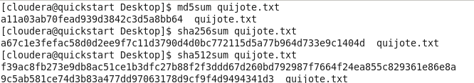
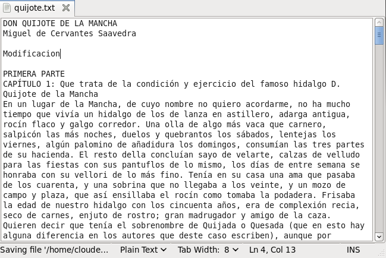
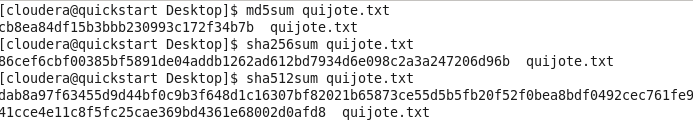
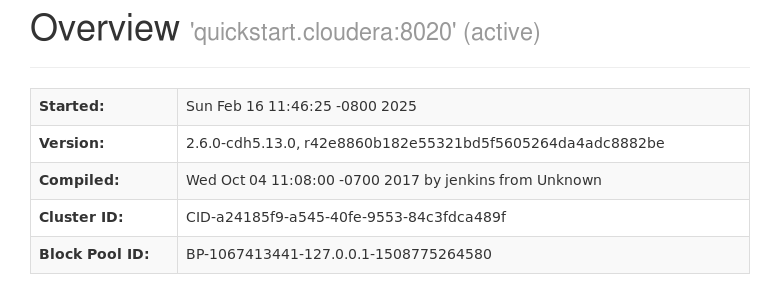
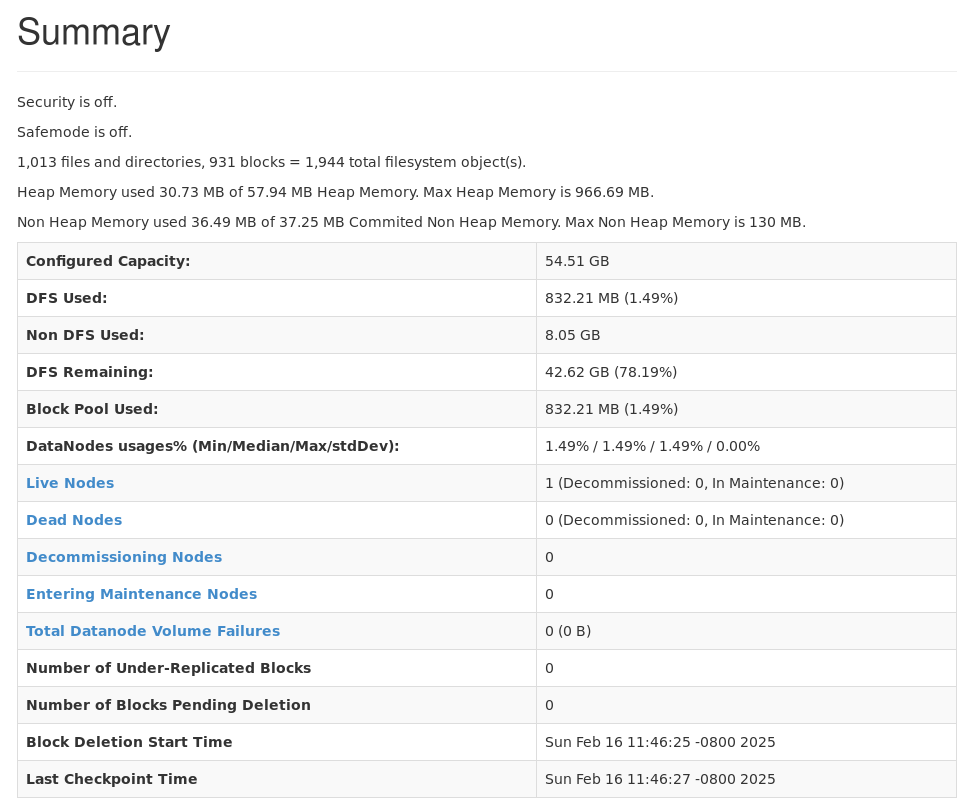
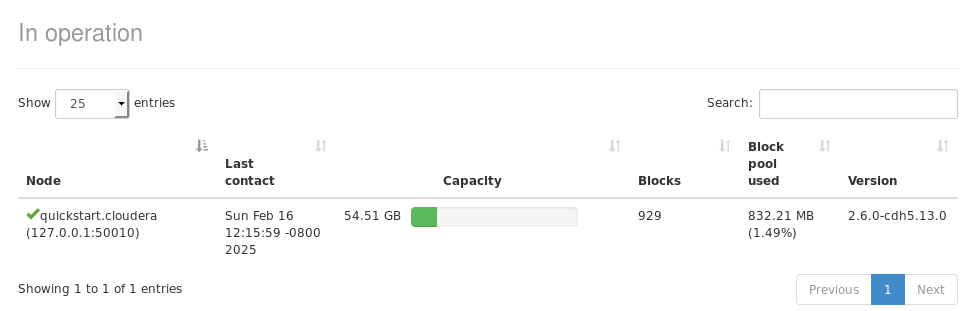
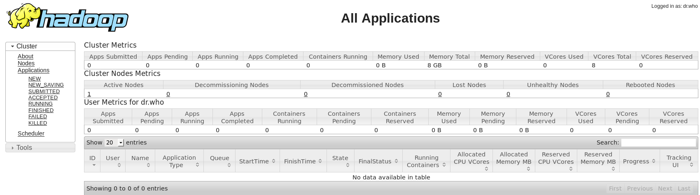
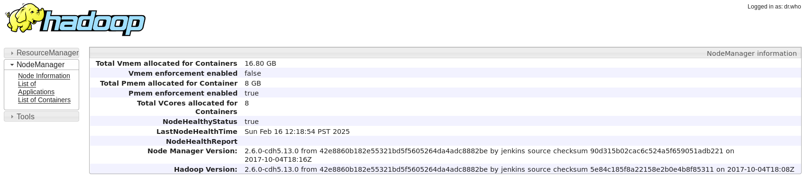

# Apartat 1: Integritat de les dades

En una màquina amb Linux (pot ser la Cloudera QuickStart VM) copia el fitxer quijote.txt que ja hem emprat en anteriors lliuraments.

- Executa les ordres md5sum, sha256sum i sha512sum per obtenir les sumes de verificació i fes una captura de pantalla on es vegin les tres sumes obtingudes.

- A continuació, fes alguna petita modificació en el fitxer quijote.txt i torna a generar les tres sumes de verificació. Fes una altra captura de pantalla on es vegin les tres.

Digues si després de fer el canvi, les sumes de verificació han canviat o no.

Com es pot observarm les tres sumes de verificació canvien amb un lleu canvi al arxiu 

Apartat 2: Eines internes de monitoratge de Hadoop

En la Cloudera QuickStart VM, fes les següents captures de pantalla i insereix-les en el teu document:

- HDFS NameNode: http://quickstart.cloudera:50070 (apartats Overview i Summary). Quin espai (i percentatge) del DFS està essent utilitzat?

Esta usat 832.21 MB (1.49%) del DFS

- HDFS DataNode information: http://quickstart.cloudera:50070/dfshealth.html#tab-datanode. Quants blocs conté el DataNode actualment?

Conte 929 blocs

- Dades de memòria del JMX. Quin és el màxim de memòria que es pot utilitzar per al heap?

- YARN ResourceManager: http://quickstart.cloudera:8088/cluster

- YARN NodeManager: http://quickstart.cloudera:8042/node

Executa un treball en Pig i inclou també la captura del YARN ResourceManager. Indica si hi ha algun canvi respecte de la captura anterior del ResourceManager.

