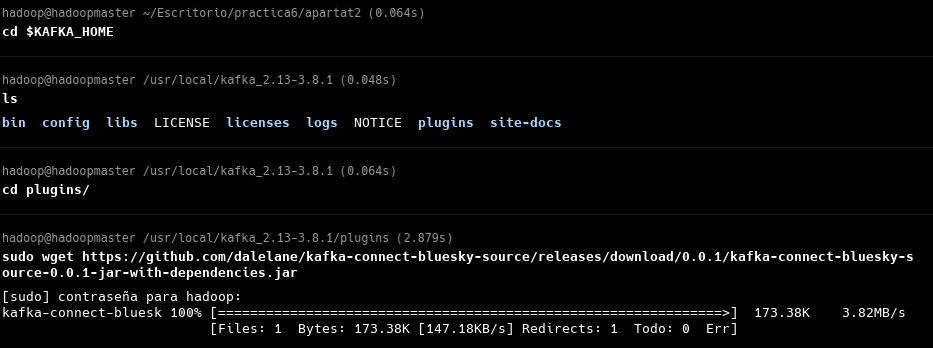
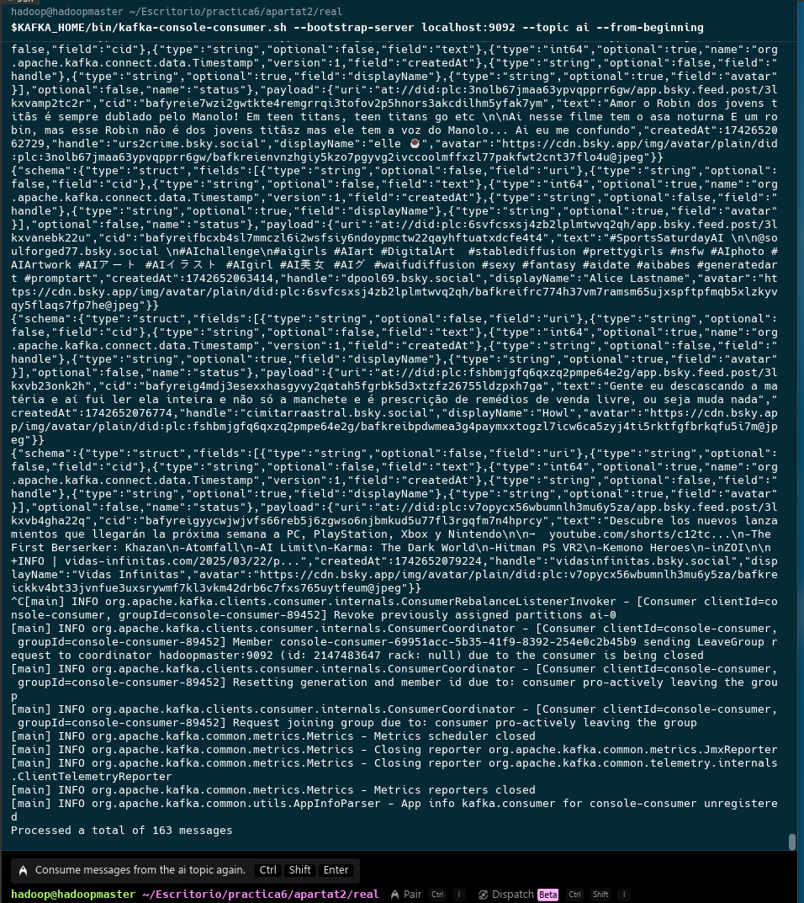
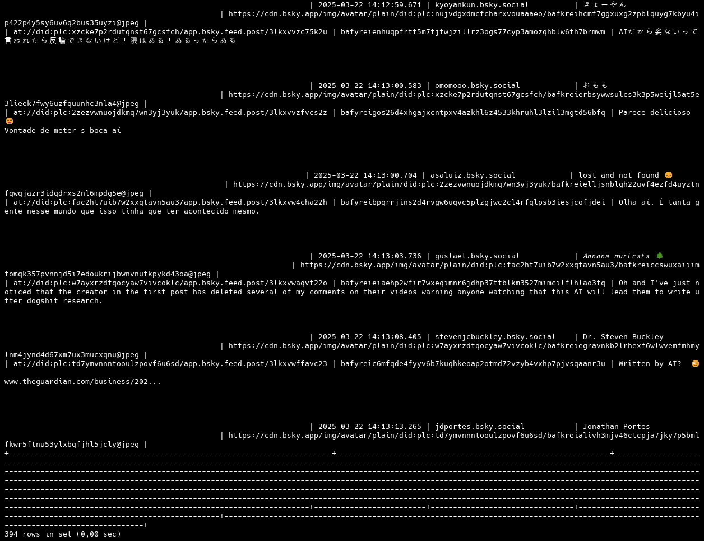

### Apartat 2

Descarregarem el connector proporcionat als apunts

Aprofitant el aprenentage que me ha donat el apartat 1 sobre un poc de scripting, he procedit a fer un script molt simple per arrancar tot i aixi fer tota la feina amb una comanda.

!Disclaimer
Estava aprofitant el us de la maquina de Hadoop, i se ha hagut de actualitzar java. `dnf yum install java21-openjdk-devel`

Una vegada executada nomes la part de bluesky, tenim el output que se pot trobar al resultat1.txt o es pot veure en aquesta foto

Aixi com va avancant la activitat, canviare la cerca per ser mes precis i veure correctament el post que fagi, ja que com es pot veure, "ai" es un terme un tant empleat

Eliminam el connector actual:
`curl -X DELETE http://localhost:8083/connectors/bluesky`

Ara, en adicio, es demana que es fagi un upsert del missatge a MySQL. Procedirem amb el mysql-sink.json

I ara anirem a checkear la base de dades:

De la primera vegada que he encolat els missatges sense filtrar massa el topic, hi ha 300 inserts. Ara probare nomes amb el exclussiu.

