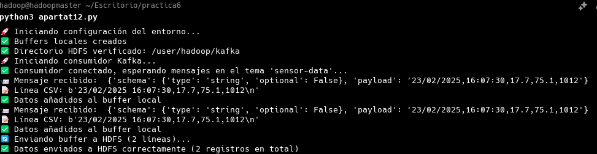
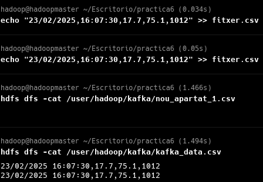
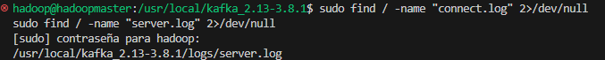
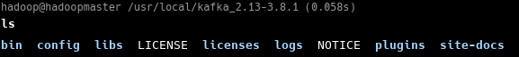
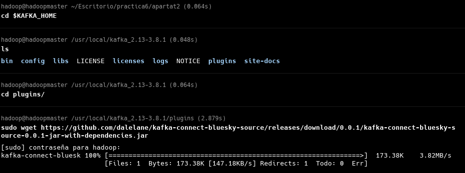
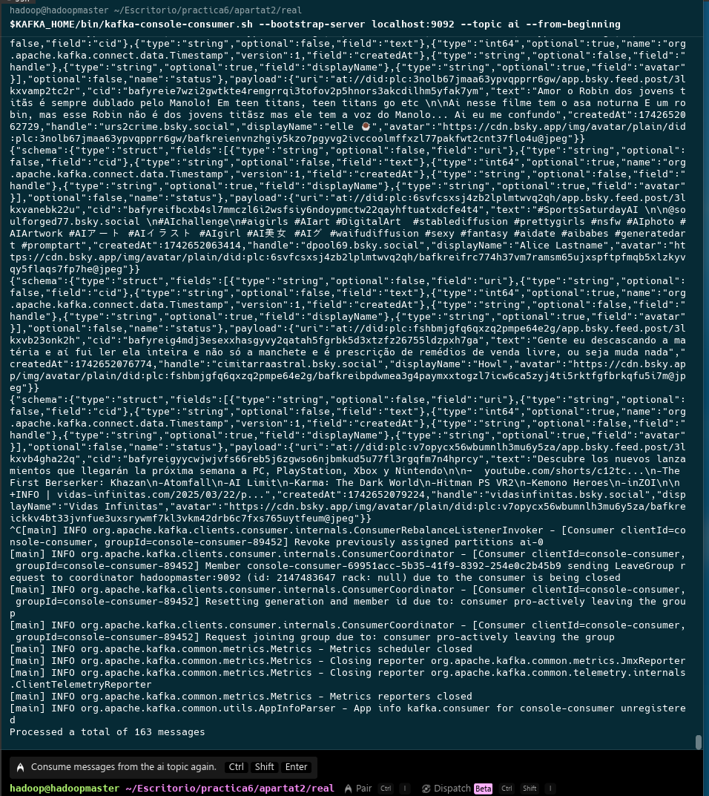
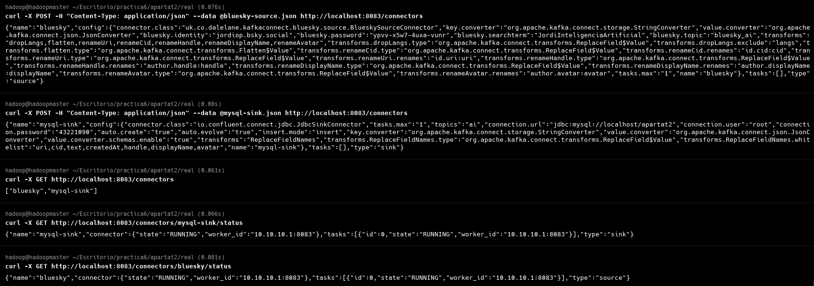
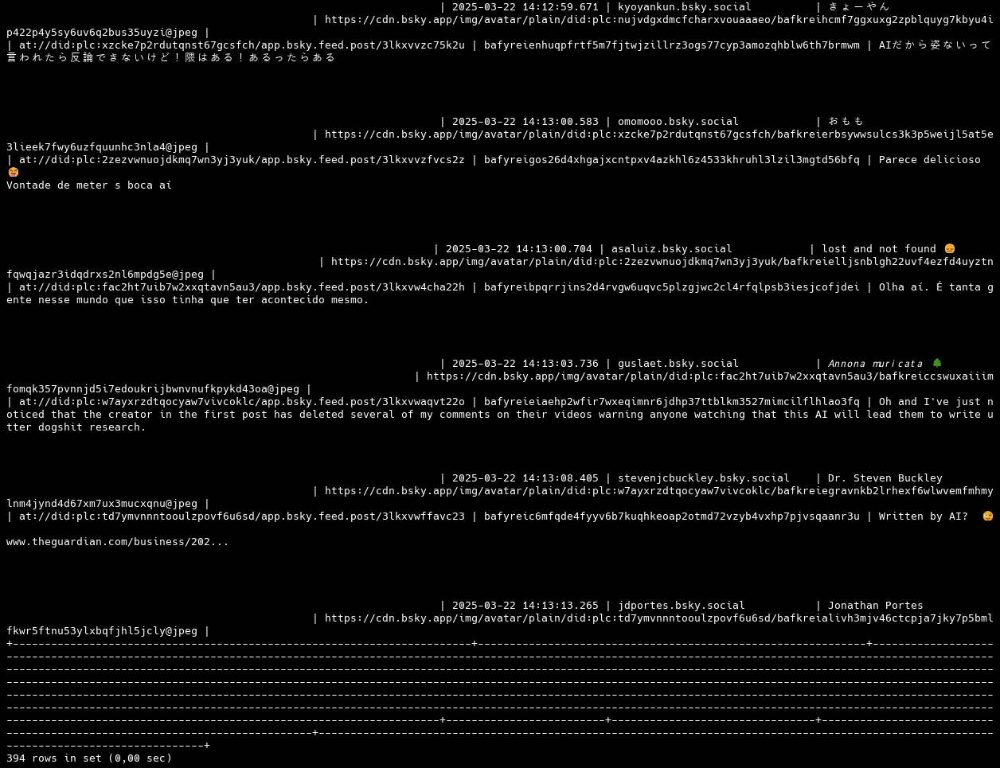
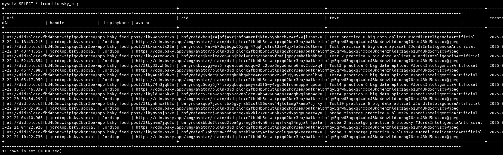

## BIG DATA APLICAT
### Pràctica 6: Kafka
### 1. Apartat 1

#### 1.1 Instruccions

Tenim un fitxer CSV on simularem que un sensor va escrivint lectures de diverses variables ambientals, separades per comes (,), amb el format següent:

data: cadena de text amb la data de la lectura, en format dd/mm/yyyy. Per exemple: 23/02/2025
hora: cadena de text amb l'hora de la lectura, en fomat hh:mm:ss. Per exemple: 16:07:30
temperatura: nombre real (float), expressada en graus centígrads. Per exemple: 17.7
humitat: nombre real (float), expressada en percentatge. Per exemple: 75.1
pressió: nombre real (enter), expressada en mil·libars. Per exemple: 1012

Has de configurar un connector source (en mode distribuït) per llegir aquestes dades i guardar-les en un topic de Kafka.

A continuació, emprant Python i la llibreria hdfs, has d'anar bolcant els esdeveniments a un fitxer en HDFS del teu clúster Hadoop. Si ho prefereixes, pot emprar una configuració amb només un únic node.

El format del fitxer serà el següent, amb els valors separat per punts i comes (;):

datahora: nombre enter, amb la data i hora en format timestamp de Unix.
temperatura
pressió
humitat

Per provar-ho, simula les lectures del sensor mitjançant echo, com hem fet en els apunts. Per exemple:

echo "23/02/2025,16:07:30,17.7,75.1,1012" >> fitxer.csv


#### 1.2 Preparació i configuració per la tasca

Iniciar els serveis necesaris:
```bash
bin/zookeeper-server-start.sh config/zookeeper.properties
```
```bash
bin/kafka-server-start.sh config/server.properties
```
```bash
bin/connect-distributed.sh config/connect-distributed.properties
```

Crear un topic: 
```bash
bin/kafka-topics.sh --create --bootstrap-server localhost:9092 --replication-factor 1 --partitions 1 --topic sensor-data
```

Connector:
```json
{
    "name": "sensor-data-source",
    "config": {
        "connector.class": "FileStreamSource",
        "tasks.max": "1",
        "file": "resultat.csv",
        "topic": "sensor-data",
        "key.converter": "org.apache.kafka.connect.storage.StringConverter",
        "value.converter": "org.apache.kafka.connect.storage.StringConverter",
        "mode": "tail"
    }
}
```

Deploy connector:
```bash
curl -X POST -H "Content-Type: application/json" --data @sensor-connector.json http://localhost:8083/connectors
```

#### 2. Execució de la tasca
```bash
echo "23/02/2025,16:07:30,17.7,75.1,1012" >> fitxer.csv
echo "23/02/2025,16:08:30,17.8,74.9,1011" >> fitxer.csv
echo "23/02/2025,16:09:30,18.0,74.6,1011" >> fitxer.csv
echo "23/02/2025,16:10:30,18.2,74.3,1010" >> fitxer.csv
```

Verificar que les dades s'han enviat correctament:
```bash
bin/kafka-console-consumer.sh --bootstrap-server localhost:9092 --topic sensor-data --from-beginning
```

Python consumer:

##### IMPORTANT

Després d'un debugging molt profund, posaré a disposició de l'activitat els problemes amb el append i la creació i modificació del arxiu de hdfs. La solució, després de mirar els fòrums, documentació, Stack Overflow, GitHub, ha estat demanar ajuda. Kudos a Carlos (@CharlyMech), amb el qual hem tengut converses sobre aquesta activitat. Al final, entre ell i un poc de Claude 3.7, he aconseguit fer un script que sí que em fa append però que sé que és overkill (buffers, pujar l'arxiu sencer cada vegada, etc)

En el proces, hi ha la cerca i creacio del reparador.sh, que és un cleaner de tot el de hadoop, sospitant que posiblement, el major dels problemes fos més el "cluster" que no tant el script. Inclus així, trob que és necessari donar el context i el perquè de tot.

```python
python hdfs_consumer.py
```



Checkear que les dades s'han guardat correctament:
```bash
hdfs dfs -cat /sensor_data/readings.csv
```



El log disponible que tenc el server.log. El connect.log no existeix en cap part del sistema, imagin que perquè al server-config, es fica a una carpeta que no existeix.



```bash
# Del server-properties
# A comma separated list of directories under which to store log files
log.dirs=/tmp/kafka-logs
```

Directori del kafka 



#### 2. Apartat 2

### Apartat 2

Volem guardar els missatges de Bluesky a partir d'una (o més) paraula de cerca (la que vulguis, però millor una de la qual es generin missatges sovint) en una base de dades MySQL per poder processar-ho posteriorment.

Has de configurar un connector source (en mode distribuït) per llegir missatges de Bluesky segons la teva cerca i guardar-los com a esdeveniments en un topic de Kafka.

A continuació, emprant el connector de JDBC sink (en mode distribuït), has de guardar els esdeveniments en una taula de MySQL. La taula ha de tenir totes les dades de l'esdeveniment de l'objecte payload, excepte el camp langs. Són aquests:

    uri
    cid
    text
    createdAt
    handle
    displayName
    avatar


ALERTA

Els missatges que genera el connector de Bluesky contenen un struct amb dades de l'id (amb els camps uri i cid), un array amb els idiomes i un altre struct amb les dades de l'autor (amb els camps handle, displayName i avatar). 

MySQL no pot gestionar aquests tipus de dades complexos, així que hem d'aplicar diverses transformacions SMT en el connector de Bluesky perquè els missatges es puguin mapejar a una taula MySQL. Aplicarem aquestes transformacions:

    Transformació Flaten per posar tots els camps directament a l'objecte payload, eliminant els structs. Així, el struct id donarà lloc als camps id.uri i id.cid i el struct author als camps author.handle, author.displayName i author.avatar. Podeu trobar més informació de la transformació Flatten i un exemple del seu ús.
    No podem emprar el punt en el nom d'una columna de MySQL, així que hem d'aplicar una transformació ReplaceField per canviar el nom dels camps que han sorgit dels structs: id.uri a uri, id.cid a cid, author.handle a handle, etc. Podeu trobar més informació de la transformació ReplaceField i un exemple del seu ús.
    Ens queda llevar el camp langs, que és un array. O el que és el mateix, seleccionar-ne tots els altres. Aplicarem una altra transformació ReplaceField per seleccionar tots els camps que volem que apareguin en la nostra taula. Emprarem la propietat whitelist per identificar els camps que volem.

Descarregarem el connector proporcionat als apunts



Aprofitant el aprenentatge que m'ha donat l'apartat 1 sobre un poc de scripting, he fet un script molt simple per arrancar tot i així fer tota la feina amb una comanda.

```bash 
echo "Starting Kafka and Zookeeper"

echo "Starting Zookeeper"
$KAFKA_HOME/bin/zookeeper-server-start.sh config/zookeeper.properties
echo "Starting Kafka"
$KAFKA_HOME/bin/kafka-server-start.sh config/server.properties
echo "Starting Schema Registry"
$KAFKA_HOME/bin/connect-distributed.sh config/connect-distributed.properties

echo "Creating topics from connector"
curl -X POST -H "Content-Type: application/json" --data @bluesky-source.json http://localhost:8083/connectors

echo 'Enable the mysql connector'
curl -X POST -H "Content-Type: application/json" --data @mysql-sink.json http://localhost:8083/connectors

echo "Check the status of the connector"
echo "Status of Bluesky connector"
curl -x GET http://localhost:8083/connectors/bluesky-source/status
echo "Status of Mysql connector"
curl -x GET http://localhost:8083/connectors/mysql-sink/status


echo "Check the status of the connector"
$KAFKA_HOME/bin/kafka-console-consumer.sh --bootstrap-server localhost:9092 --topic bluesky --from-beginning

echo "Pause to wait the post in Bluesky"
read -p "Press enter to continue" 

echo "Check the table of mysql"
mysql -u root -p
use apartat2;
select * from ai;
exit;
```

Aixi tenim totes les comandes i se pot veure el que he emprat.

!Disclaimer
Estava aprofitant el us de la maquina de Hadoop, i se ha hagut de actualitzar java. `dnf yum install java21-openjdk-devel`

Una vegada executada nomes la part de bluesky, tenim el output que se pot trobar al resultat1.txt o es pot veure en aquesta foto


Així com va avançant l'activitat, canviaré la cerca per ser més precís i veure correctament el post que faci, ja que com es pot veure, "ai" és un terme un tant empleat

Eliminam el connector actual:
`curl -X DELETE http://localhost:8083/connectors/bluesky`

Ara, en adició, es demana que es faci un upsert del missatge a MySQL. Procedirem amb el mysql-sink.json

I ara anirem a checkear la base de dades:






De la primera vegada que he encolat els missatges sense filtrar massa el tòpic, hi ha 300 inserts. Ara provaré només amb el exclusiu.
El tòpic és bluesky_ai, i els missatges són d'aquest estil

 

He canviat i estic emprant una instal·lació nova d'Ubuntu, perquè em dona menys problemes que el Fedora.

