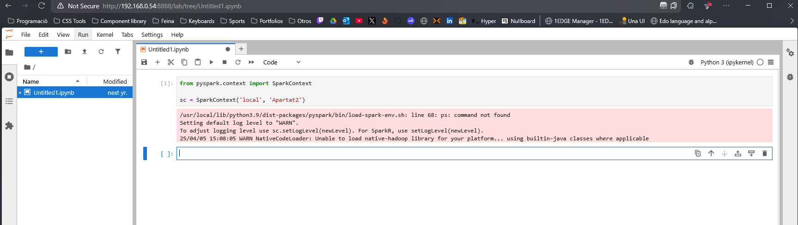

# Configuració d'un clúster Spark amb Docker

Aquest document explica les passes per crear un clúster Spark amb Docker, consistent en 1 node mestre, 3 nodes worker i un node amb JupyterLab.

## 1. Instal·lació de Docker

Primer, cal instal·lar Docker i Docker Compose si no els tenim ja instal·lats:


```bash
# Actualitzar repositoris
sudo apt update

# Instal·lar dependències
sudo apt install apt-transport-https ca-certificates curl software-properties-common -y

# Afegir la GPG Key de Docker
sudo su
curl -fsSL https://download.docker.com/linux/ubuntu/gpg | apt-key add -

# Afegir el repositori de Docker
add-apt-repository "deb [arch=amd64] https://download.docker.com/linux/ubuntu focal stable"

# Sortir de root
exit

# Actualitzar novament
sudo apt update

# Instal·lar Docker i Docker Compose
sudo apt install docker-ce docker-compose -y

# Activar el servei
sudo systemctl start docker

# Verificar la instal·lació
sudo docker run hello-world
```

## 2. Creació de les imatges Docker

Crearem un directori per al nostre projecte i descarregarem els fitxers necessaris:

```bash
mkdir -p ~/cluster
cd ~/cluster
```

Descarregam els fitxers Dockerfile per a les imatges:
- spark-master.Dockerfile
- spark-worker.Dockerfile
- jupyterlab.Dockerfile
- build.sh

Aquests fitxers es poden obtenir del repositori GitHub:
- https://github.com/tnavarrete-iedib/bigdata-24-25/blob/main/docker/spark-master.Dockerfile
- https://github.com/tnavarrete-iedib/bigdata-24-25/blob/main/docker/spark-worker.Dockerfile
- https://github.com/tnavarrete-iedib/bigdata-24-25/blob/main/docker/jupyterlab.Dockerfile
- https://github.com/tnavarrete-iedib/bigdata-24-25/blob/main/docker/build.sh


Executem l'script build.sh per crear les imatges:

```bash
sudo bash build.sh
```

Verificam que s'han creat les imatges:

```bash
sudo docker images
```


## 3. Configuració del docker-compose.yml

Cream un fitxer `docker-compose.yml` amb el següent contingut:

```yaml
version: '3.8'

volumes:
  hdfs-simulat:
    name: "hadoop-dfs"
    driver: local

services:
  spark-master:
    image: spark-master
    container_name: spark-master
    ports:
      - "7077:7077"
      - "8080:8080"
    volumes:
      - hdfs-simulat:/opt/workspace
  
  spark-worker-1:
    image: spark-worker
    container_name: spark-worker-1
    depends_on:
      - spark-master
    ports:
      - "8081:8081"
    volumes:
      - hdfs-simulat:/opt/workspace
  
  spark-worker-2:
    image: spark-worker
    container_name: spark-worker-2
    depends_on:
      - spark-master
    ports:
      - "8082:8081"
    volumes:
      - hdfs-simulat:/opt/workspace
  
  spark-worker-3:
    image: spark-worker
    container_name: spark-worker-3
    depends_on:
      - spark-master
    ports:
      - "8083:8081"
    volumes:
      - hdfs-simulat:/opt/workspace
  
  jupyterlab:
    image: jupyterlab
    container_name: jupyterlab
    depends_on:
      - spark-master
    ports:
      - "8888:8888"
    volumes:
      - hdfs-simulat:/opt/workspace

```


El canvi principal respecte a la versió original és l'afegit del servei `spark-worker-3` que exposa el port 8083.

## 4. Posada en marxa dels contenidors

Executem el següent comandament per iniciar tots els contenidors:

```bash
sudo docker-compose up
```

Per executar-lo en segon pla (mode desacoblat):

```bash
sudo docker-compose up -d
```


Verificam que tots els contenidors s'han iniciat correctament:

```bash
sudo docker container ls
```


## 5. Accés a les interfícies web

Un cop iniciats els contenidors, podem accedir a les diferents interfícies web:

- **Spark Master**: http://localhost:8080
- **Spark Worker 1**: http://localhost:8081
- **Spark Worker 2**: http://localhost:8082
- **Spark Worker 3**: http://localhost:8083
- **JupyterLab**: http://localhost:8888

## 6. Captures de pantalla

### Spark Master UI


### Spark Worker 1 UI


### Spark Worker 2 UI


### Spark Worker 3 UI


### JupyterLab UI


## 7. Treballar amb JupyterLab

Un cop accedim a la interfície de JupyterLab, podem crear un nou notebook Python i connectar-nos al cluster:

```python
from pyspark.context import SparkContext
sc = SparkContext('spark://spark-master:7077', 'Spark des de JupyterLab')
```



## 8. Aturar els contenidors

Quan volguem aturar el clúster, podem utilitzar:

```bash
sudo docker-compose down
```

Aquest comandament atura i elimina els contenidors, però manté les imatges i els volums.

## 9. Consideracions addicionals

- Si necessitam més recursos per als workers, podem modificar les variables d'entorn en el fitxer docker-compose.yml.
- El volum `hdfs-simulat` és compartit entre tots els nodes, simulant un sistema de fitxers distribuït.
- Per a la propera posada en marxa, només cal executar novament `sudo docker-compose up`.