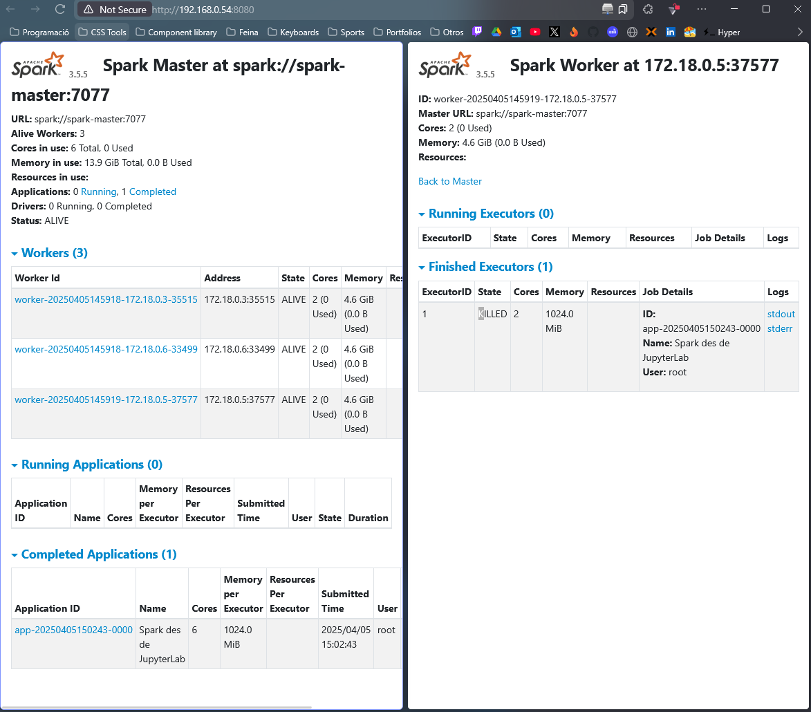

## Apartat 2
### Codi
```py
import re
from pyspark import SparkContext

def count_words_with_vowels(file_path):
    """
    Count words that start and end with vowels in a text file.
    Args: file_path (str): Path to the text file 
    Returns: PySpark RDD containing (word, count) pairs
    """
    try:
        content = sc.textFile(file_path)
        
        # Define vowel pattern - including both lowercase and uppercase vowels with accents
        vowel_pattern = r'^[aeiouáéíóúAEIOUÁÉÍÓÚ].*[aeiouáéíóúAEIOUÁÉÍÓÚ]$'
        
        # Process the data
        word_counts = (
            content
            .flatMap(lambda line: re.findall(r'\b\w+\b', line))
            .filter(lambda word: re.match(vowel_pattern, word.lower()))
            .map(lambda word: (word.lower(), 1))
            .reduceByKey(lambda x, y: x + y)
            .cache()  # Cache the result if it will be used multiple times (era molt lent)
        )
        
        return word_counts
    
    except Exception as e:
        print(f"Error processing file: {e}")
        return None

if __name__ == "__main__":
    file_path = 'quijote.txt'
    result = count_words_with_vowels(file_path)
    
    if result:
        sorted_results = result.sortBy(lambda x: x[1], ascending=False)
        
        for word, count in sorted_results.collect():
            print(f'{word}: {count}')
```

### Execucio amb resultat

