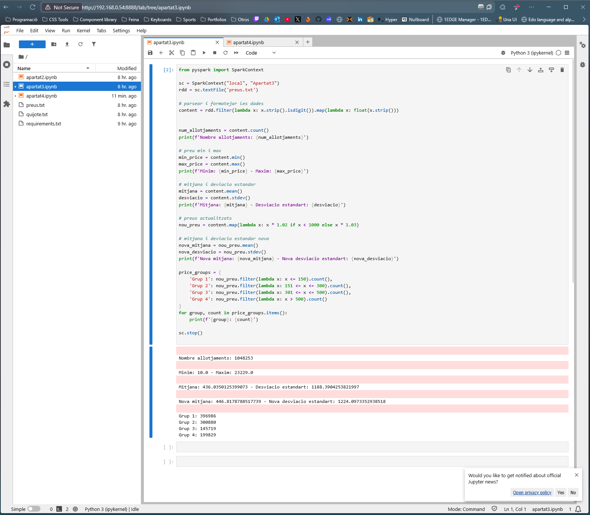

## Apartat 3
### Codi
```py
from pyspark import SparkContext

sc = SparkContext("local", "Apartat3")
rdd = sc.textFile('preus.txt')

# parsear i formatejar les dades
content = rdd.filter(lambda x: x.strip().isdigit()).map(lambda x: float(x.strip()))


num_allotjaments = content.count()
print(f'Nombre allotjaments: {num_allotjaments}')

# preu min i max
min_price = content.min()
max_price = content.max()
print(f'Minim: {min_price} - Maxim: {max_price}')

# mitjana i deviacio estandar
mitjana = content.mean()
desviacio = content.stdev()
print(f'Mitjana: {mitjana} - Desviacio estandart: {desviacio}')

# preus actualitzats
nou_preu = content.map(lambda x: x * 1.02 if x < 1000 else x * 1.03)

# mitjana i deviacio estandar nova
nova_mitjana = nou_preu.mean()
nova_desviacio = nou_preu.stdev()
print(f'Nova mitjana: {nova_mitjana} - Nova desviacio estandart: {nova_desviacio}')

price_groups = {
	'Grup 1': nou_preu.filter(lambda x: x <= 150).count(),
	'Grup 2': nou_preu.filter(lambda x: 151 <= x <= 300).count(),
	'Grup 3': nou_preu.filter(lambda x: 301 <= x <= 500).count(),
	'Grup 4': nou_preu.filter(lambda x: x > 500).count()
}
for group, count in price_groups.items():
	print(f'{group}: {count}')

sc.stop()
```

### Execucio amb resultat

