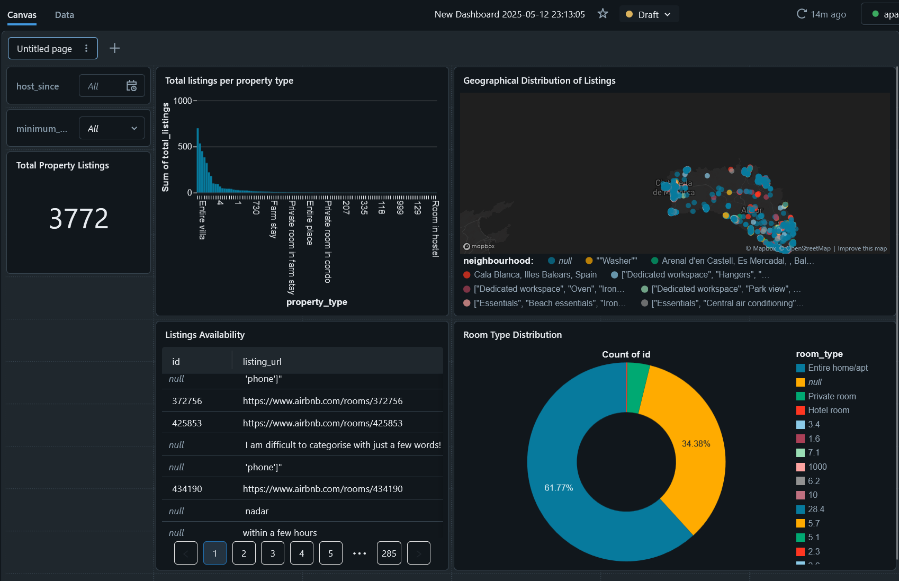

Per poder fer aquest apartat haurem de crear un SQL Warehouse

Cream un dashboard

I a partir del dataset treim les taules que ens interessen. En el meu cas, no he comencat a fer joins, pero he tret algunes dades interessants.

Notes:
El mapa esta molt be, pero el fet de que hi hagi locations nules fa que es perdi bastant la gràcia.
Igualment, ens donem compte de les tendencies costaneres i de les zones mes turístiques.

Com apunt sense relevancia, em pareix que els dashboards de Power BI son molt mes atractius que els de Databricks. Lis pots donar mes personalitat i son mes intuitius.