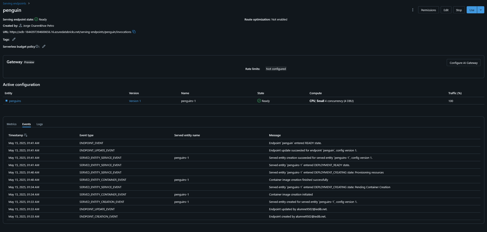

## Cream un nou recurs


## Cream un experiment


## Seleccionearem classificació


## Configuració del model


Ara a una de les mostres registrarem el model. L'he deixat entorn a 1 hora.





```json
{
  "dataframe_split": {
    "columns": [
      "island",
      "culmen_length_mm",
      "culmen_depth_mm",
      "flipper_length_mm",
      "body_mass_g",
      "sex"
    ],
    "data": [
      [
        "Torgersen",
        "39.1",
        "18.7",
        "181",
        "3750",
        "MALE"
      ],
      [
        "Torgersen",
        "36.7",
        "19.3",
        "193",
        "3450",
        "FEMALE"
      ],
      [
        "Torgersen",
        "38.9",
        "17.8",
        "181",
        "3625",
        "FEMALE"
      ],
      [
        "Torgersen",
        "39.2",
        "19.6",
        "195",
        "4675",
        "MALE"
      ],
      [
        "Torgersen",
        "37.8",
        "17.3",
        "180",
        "3700",
        "NA"
      ]
    ]
  }
}
```

```json
{
  "predictions": [
    "Adelie",
    "Adelie",
    "Adelie",
    "Adelie",
    "Adelie"
  ]
}
```

Dades tretes de la activitat de Carlos Sanchez Recio:

```json
{
	"dataframe_split": {
		"columns": [
			"island",
			"culmen_length_mm",
			"culmen_depth_mm",
			"flipper_length_mm",
			"body_mass_g",
			"sex"
		],
		"data": [
			["Biscoe", "39.1", "18.7", "181.0", "3750.0", "FEMALE"],
			["Dream", "45.3", "17.1", "200.0", "4200.0", "MALE"],
			["Torgersen", "50.0", "15.2", "210.0", "5000.0", "MALE"]
		]
	}
}
```

```json
{
  "predictions": [
    "Adelie",
    "Chinstrap",
    "Gentoo"
  ]
}
```

Les conclusions son que el model es erroni, cosa que puc imagina que pot ser degut per la falta de dades o de entrenament. Probablement, amb mes temps i un finetunning mes acurat, el model podria millorar.