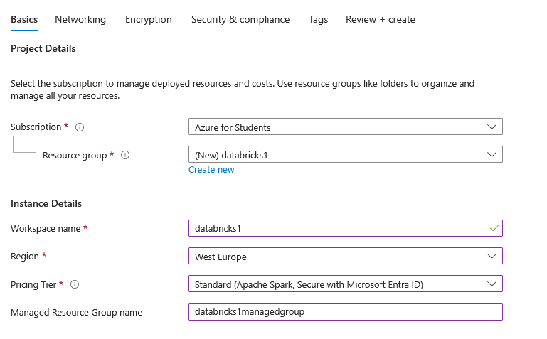
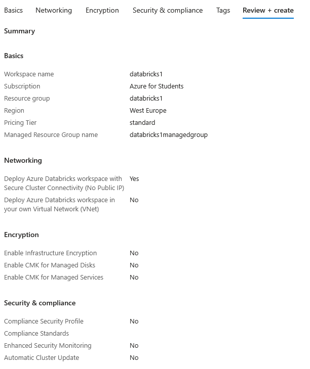
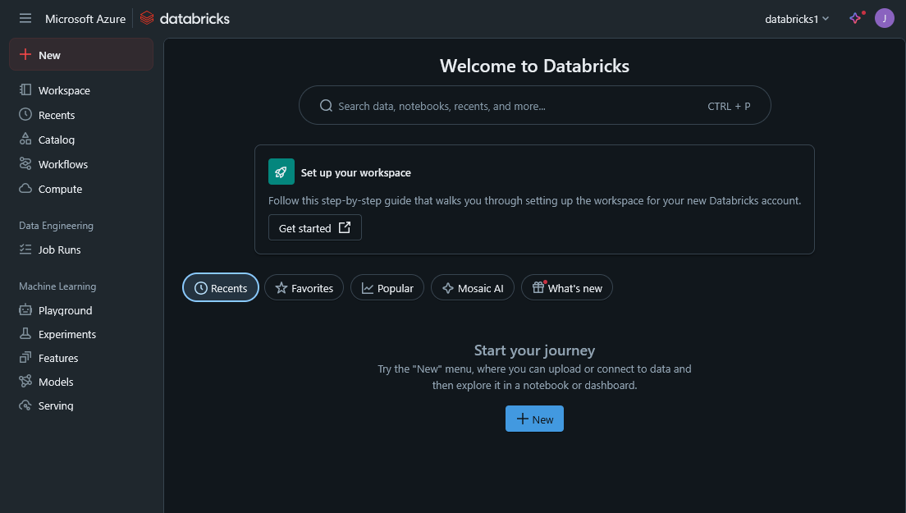
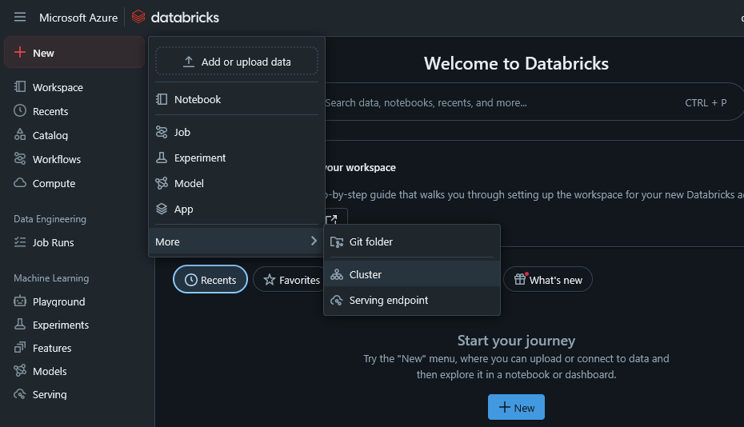
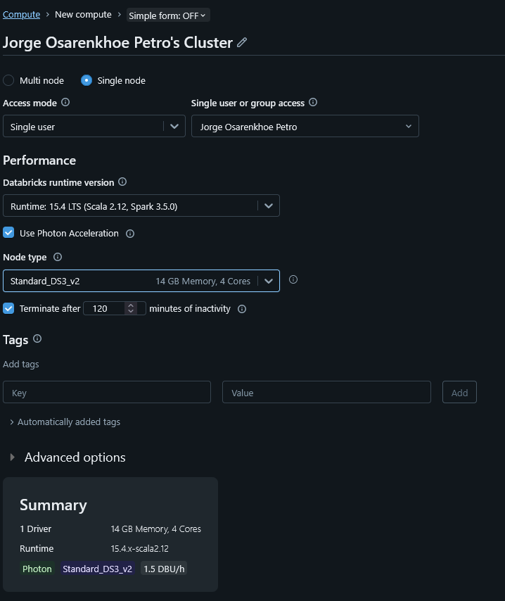
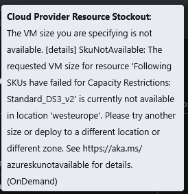
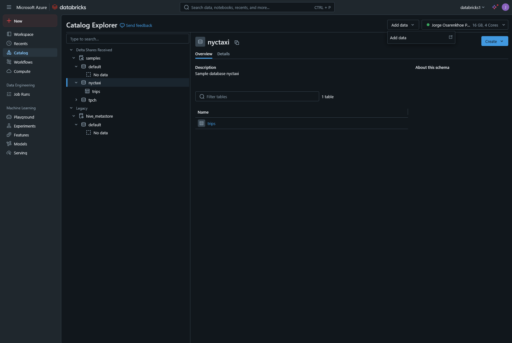
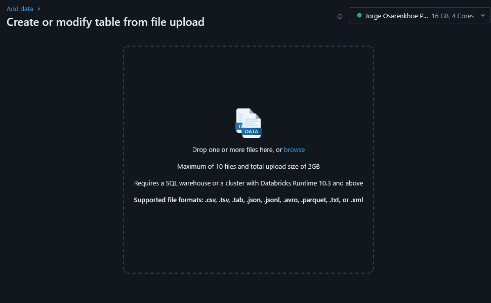
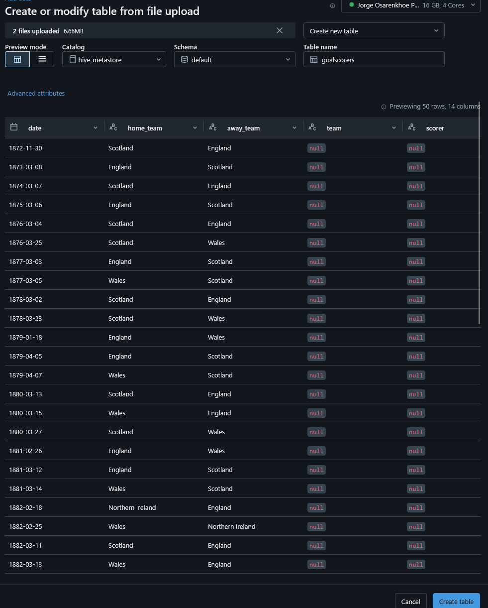
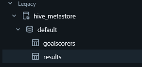

## BDA: Practica 8

Cream el azure databricks i el notebook per a la pràctica 8.

Despres de crear la instancia, arribam a aquesta pantalla on podem crear un cluster.

#### Problema
No hi ha la configuracio de cluster que en demanem: 

Com alternatives hi ha esperar o crear un altre cluster. Et deixa engegar el cluster un altre pic per si els recursos ja estan disponibles.
A nes final, vaig optar per canviar la configuracio del node. 

Afegim les dades:

