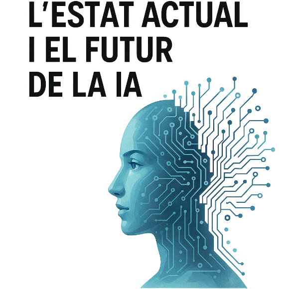

    

## Pràctica 8:  Estat de l'art i futur

Podeu seguir alguns d'aquests eixos, per exemple, o bé triar-ne uns altres que us encaixin més. 
### 1) Resum dels lliuraments del mòdul (o de tot el curs d'especialització), què he après i què em queda per aprendre
### 2) Com ho aplic a la meva feina o com puc aplicar-ho en el futur?
### 3) Com seguiré la meva formació en aquest camp o milloraré de feina publicitant el que sé?
### 4) Com pens que impacta la IA a la societat i què puc fer de positiu dins les meves possibilitats?
### 5) Quins aspectes de l'AI Index m'interessen més o trob més importants
### 6) Quins autors o llibres de la llista proposada, o d'altres, vull llegir i per què...

## Introducció

La IA és un camp en constant evolució i expansió, i és important reflexionar sobre el que hem après i com podem aplicar-ho en el futur. En aquest document, faré un resum dels lliuraments del mòdul, reflexionaré sobre la seva aplicació a la meva feina, i discutiré com seguiré la meva formació en aquest camp. També abordaré l'impacte de la IA a la societat i els aspectes que considero més rellevants de l'AI Index.

### 1. Resum dels lliuraments del mòdul

Una dada graciosa sobre aquest curs es que em vaig apuntar perquè alguns dels meus amics també s'hi havien apuntat, i no sabia que era un curs d'especialització del tot. Un amic meu va fer el de Ciberseguretat i el feedback no va ser molt possitiu. Ell em deia que fent feina no li podia dedicar tot el temps que l'hi hagués agradat. Anava un poc condicionat per aquest feedback, i pensava que el curs seria similar. Al final, m'he adonat que és un curs molt ben estructurat i amb un contingut molt interessant. He après molt sobre la IA i les seves aplicacions, així com sobre les eines i tècniques utilitzades en aquest camp.
 
Al llarg del mòdul, hem treballat amb diferents lliuraments que ens han permès aprofundir en diversos aspectes de la IA. Hem après sobre el processament de dades, l'aprenentatge automàtic, les xarxes neuronals, i la seva aplicació en diferents àmbits. Hem treballat amb eines com PySpark, TensorFlow i Keras, i hem aplicat tècniques d'anàlisi de dades i visualització. Realment a mi m'agradava de base la representació gràfica de les dades, però jo ho faig en el àmbit web a la feina. Descobrir com formatejar dades en python i fer ús de les infinites tecnologies trob que m'ha donat una amplia visió i també una realització de lo que seria a una escala industrial amb un volum alt. 

### 2. Aplicacions a la meva feina o aplicacions en el futur

Bé, com he dit abans, la representació gràfica de dades és una cosa que ja faig a la meva feina. En concret, i sense anar massa en detall, feim agregats de dades i feim resolucions per poder emplear en "Charts" interactius. Aquestes agregacions les feim amb microserveis i son guardades a un Postgres. De tot això, jo m'encarrec principalment del frontend, on empleam una versió modificada de Highcharts. Aquest ús prolongat de Highcharts, m'ha fet adaptar-me de manera practicament instantantea a les llibreries de Python empleades durant el curs. Apart, has de tenir certa idea de com funcionen les dades del que representes, perquè si no pots fer errors bàsics com els eixos. Així que en el àmbit de feina es podria dir que ja usava moltes coses donades d'aquest curs.

En quant al futur, tenc varies idees que impliquen ús de coneixements com la probabilitat o la predicció, però res massa en concret. Estava concentrat en acabar el curs donant-li tota la atenció que podia.

### 3. Com seguiré la meva formació en aquest camp o milloraré de feina publicitant el que sé?

La meva intenció és començar a llegir llibres i articles sobre IA i aprenentatge automàtic. Hi ha molts recursos disponibles en línia, com cursos, tutorials i llibres, que poden ajudar-me a aprofundir en aquest camp. També m'agradaria participar en comunitats d'IA i aprenentatge automàtic, on pugui compartir coneixements i aprendre dels altres. A més, trob que un dels meus forts es el autodidactisme, així que m'agrada aprendre per mi mateix. 

### 4. Impacte de la IA a la societat i què puc fer de positiu dins les meves possibilitats

La IA té un impacte significatiu en la societat, i crec que és important ser conscient d'aquest impacte. La IA pot millorar la nostra vida quotidiana, fer més eficients els processos empresarials i contribuir a la resolució de problemes globals. No obstant això, també hi ha preocupacions sobre la privadesa, l'ètica i l'impacte en l'ocupació. 
La IA pot ajudar a millorar la qualitat de vida de les persones, així com a optimitzar processos empresarials i socials. Per exemple, la IA pot ser utilitzada en el sector salut per diagnosticar malalties, o en el sector transport per millorar la seguretat viària. També pot ser utilitzada per analitzar grans quantitats de dades i descobrir patrons que poden ajudar a prendre decisions més informades. I com darrer exemple, si ens possam en el pitjor dels casos, la IA pot ser utilitzada per la suplantació d'identitat, creació de contingut fals o manipulació d'informació. Així que és important ser conscient dels riscos associats a la IA i treballar per mitigar-los. 

Jo estic a favor de una marca universal per la IA. Tota IA ha de deixar indicis de que és IA. Això pot ser una marca, un logo o el que sigui, però ha de ser visible i accessible. Així la gent podrà saber si el contingut que consumeix és creat per una IA o no. Per exemple, no em pareix bé que els estudiants utilitzin IA per fer els seus deures sense dir-ho. Això pot afectar la seva educació i el seu aprenentatge. Però si estic a favor de que s'ajudin de aquesta eina. Així com els ordinadors es varen integrar en la educació, també ho pot fer la IA, però amb certa messura i de manera responsable. 

### 5. Aspectes de l'AI Index que m'interessen més o trob més importants

Per jo, l'impacte en la Educació i en la Ciència és un dels aspectes més importants de l'AI Index. La IA pot millorar l'educació personalitzant l'aprenentatge i adaptant-se a les necessitats dels estudiants. També pot ajudar a millorar la investigació científica, facilitant l'anàlisi de dades i la descoberta de nous coneixements. Veig en un futur no molt llunyà un comité internacional sobre la intelligència artificial, on es discuteixin les implicacions ètiques i socials de la IA. Això pot ajudar a establir normes i directrius per l'ús responsable de la IA, així com a promoure la investigació i el desenvolupament de tecnologies d'IA que siguin beneficioses per la societat. El punt negatiu és que frenaria el desenvolupament de la IA, i això pot ser un problema. Haurem de saber trobar un equilibri entre la innovació i la seguretat.

### 6. Autors o llibres de la llista proposada, o d'altres, vull llegir i per què

Tecnofeudalisme i  La democràcia mor al núvol.

Són dos llibres amb títols impactants i parlant de la IA en un àmbit socio-politic-economic. A més, em recorden certament a la serie de HBO Westworld. A Westworld, hi ha un punt on acusen de un delicte a una persona, però resulta que la acusació es feia mitjançant una predicció d'un algoritme. Esteim enfora de que això pugui passar a la vida real? És una pregunta que ja no podem dir que no de manera rotunda.

En quant a Tecnofeudalisme, la IA es una eina que tendrà un impacte significatiu i probablement negatiu al capitalisme (si és que no està passant ja). En un sistema que se suposa que és meritocràtic, la IA pot perpetuar les desigualtats existents i crear noves formes de desigualtat. Això és un tema que m'interessa molt, ja que crec que és important ser conscient dels riscos associats a la IA i treballar per mitigar-los. Encara així, els sistemes econòmics i socials són molt complexos i no es poden reduir a una sola variable. La IA pot ser una eina poderosa, però també pot ser utilitzada de manera irresponsable o èticament dubtosa. És important seguir investigant sobre l'impacte de la IA en la societat i com podem utilitzar-la de manera responsable i ètica.

## Conclusió

Aquest curso m'ha donat una visió més àmplia de la IA i les seves aplicacions, així com de les eines i tècniques utilitzades en aquest camp. He après molt sobre el processament de dades, l'aprenentatge automàtic i les xarxes neuronals, i estic emocionat per aplicar aquests coneixements en el futur. La IA té un impacte significatiu en la societat, i crec que és important ser conscient d'aquest impacte i treballar per utilitzar la IA de manera responsable i ètica.
