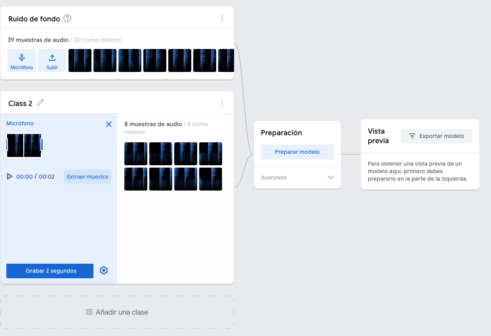
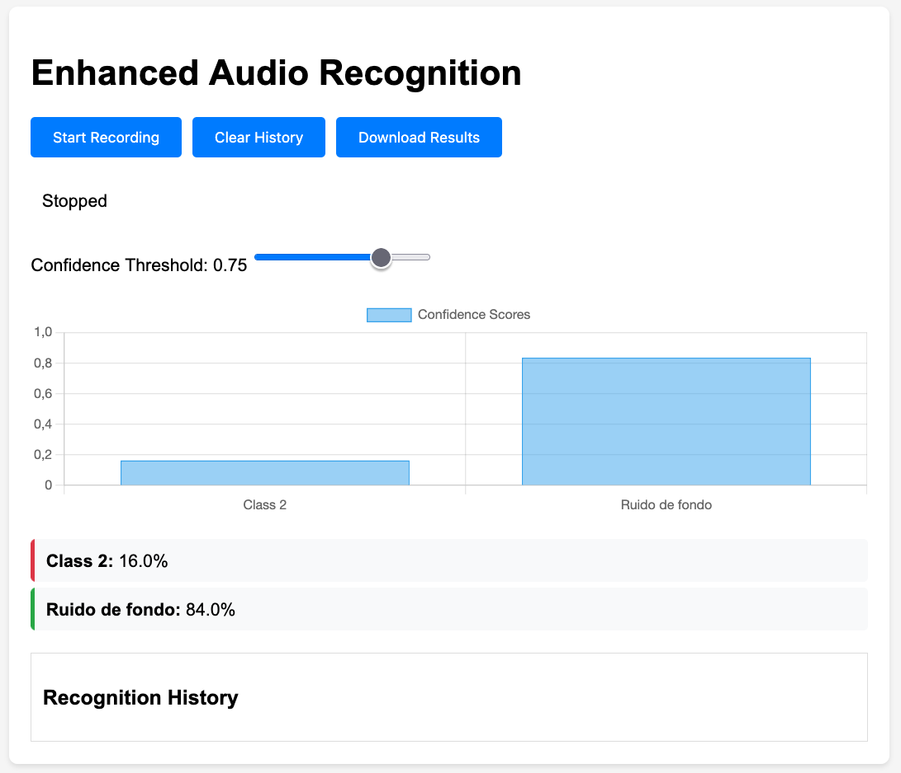

## Projecte amb Teachable Machine
Aquesta tasca té dues parts, la primera amb Teachable Machine i la segona amb un assistent de programació.
### Part A
Realitzau un projecte semblant al dels apunts, seguint les passes següents

1. Preparau els fitxers que necessiteu segons el tipus de projecte que hàgiu triat: imatge, àudio o postures.

- Enlloc de preparar els arxius de audio, he usat el micròfon per a gravar dos sons distints. El primer és un so de "clap" i el segon és un so de "snap". 

2. Pujau els fitxers a la plataforma TM, cada un a la classe corresponent.



3. Entrenau el sistema i comprovau-lo.

- El resultat obtingut es que identifica correctament els dos sons. Captura bastant bé el que és "Ruido de fondo" i el que és snap o class 2.

4. Exportau el model.

- [Teachable machine](https://teachablemachine.withgoogle.com/models/54uOD-Dmk/)

5. Publicau una pàgina web que utilitzi el vostre model, per exemple a GitHub Pages, CodePen. Si voleu usar un altre servei, o un domini propi, perfecte.

- [Model desplegat a Github IO](https://jordiop.github.io/teachable-machine-sound-prime)

### Part B
Estudiau i millorau el codi que us ha oferit Teachable Machine fent ús d'un assistent (Canvas de ChatGPT, Gemini, Copilot)

Faré ús de Claude AI que em pareix més potent que les altres opcions i a més és la eina que habitualment ús a la feina.

6. Copiau i enganxau el vostre codi a un assistent i demanau-li que us l'expliqui.

Resposta del prompt:

I'll break down this code which implements an audio recognition model created with Teachable Machine. Here's what's happening:

1. **Initial Setup and Dependencies**
- The code includes two important TensorFlow.js libraries:
  - `tfjs`: The core TensorFlow.js library
  - `speech-commands`: A specialized library for audio recognition

2. **Model Configuration**
```javascript
const URL = "https://teachablemachine.withgoogle.com/models/54uOD-Dmk/";
```
- This URL points to where your trained model is hosted
- It will load two essential files:
  - `model.json`: Contains the model's architecture
  - `metadata.json`: Contains information about the classes/labels

3. **Model Creation (`createModel` function)**
```javascript
async function createModel() {
    const recognizer = speechCommands.create(
        "BROWSER_FFT",
        undefined,
        checkpointURL,
        metadataURL);
```
- Creates a speech recognition model using the browser's Fast Fourier Transform (FFT)
- Loads your custom model instead of using predefined speech commands
- Ensures the model is fully loaded before proceeding

4. **Initialization (`init` function)**
- This is triggered when the "Start" button is clicked
- Sets up the display containers for each class label
- Starts the audio recognition process

5. **Audio Recognition Loop**
```javascript
recognizer.listen(result => {
    const scores = result.scores;
    // Display predictions
}, {
    includeSpectrogram: true,
    probabilityThreshold: 0.75,
    invokeCallbackOnNoiseAndUnknown: true,
    overlapFactor: 0.50
});
```
Key configuration options:
- `probabilityThreshold: 0.75`: Only shows predictions with 75% or higher confidence
- `overlapFactor: 0.50`: How much consecutive audio samples overlap (50% in this case)
- `includeSpectrogram: true`: Includes the audio spectrogram in results
- `invokeCallbackOnNoiseAndUnknown: true`: Reports even when no clear match is found

6. **Display Logic**
- Creates a div for each possible class/label
- Continuously updates the probabilities for each class
- Shows the class name and its probability score (rounded to 2 decimal places)

7. **HTML Structure**
- Simple interface with:
  - A title
  - A start button that triggers the `init()` function
  - A container (`label-container`) that shows the recognition results

This code creates a continuous audio recognition system that:
1. Listens to audio input from your microphone
2. Processes it through your trained model
3. Displays real-time probability scores for each class you trained
4. Updates these probabilities continuously until stopped

The model will keep running until either the page is closed or you implement a stop mechanism (there's a commented-out setTimeout example in the code that would stop after 5 seconds).

7. Pensau algun canvi de funcionalitat que volgueu afegir al sistema.

- Afegir un botó de "Reset" per a tornar a l'estat inicial del sistema.
- Afegir un històric de les prediccions fetes i un botó clear.
- Afegir un slider per a canviar el threshold de probabilitat.
- Afegir els confidence scores a la gràfica de la prediccions.


8. Demanau a l'assistent que us ajudi a codificar-lo.

Després de demanar a l'assistent que m'ajudi a codificar les funcionalitats que volia afegir, he obtingut el següent:



De igual manera, he hagut de modificar el codi per a que les funcionalitats afegides funcionessin correctament.

9. Comprovau que el codi es comporta com voleu.

El codi donat se comporta com s'esperava.

10. Publicau el vostre sistema millorat en una URL diferent, de forma que es puguin comparar tots dos.

- [Model desplegat a Github IO](https://jordiop.github.io/teachable-machine-sound/)

Lliurau un document amb una captura de cada passa i les URLs on es puguin provar els vostres dos sistemes.
