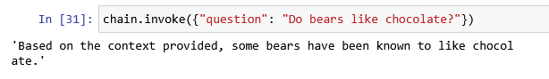

# Pràctica 8: Deeplearning AI i LangChain

D'ença de l'aparició de ChatGPT el novembre del 2022, l'automatització via text va prenent un gran protagonisme i s'hi van desenvolupant noves aplicacions i integracions.

Una combinació molt potent és la incorporació d'eines externes per a usar des d'un model de llenguatge extens (MLE).

LangChain és un entorn ideal per a la integració d'un MLE com GPT amb eines externes que permetin realitzar consultes en temps real de fonts d'informació que ens interessi integrar en el diàleg amb un sistema automàtic.

Per això, en aquesta tasca treballarem LangChain com a via d'ús de GPT-3.5. A més, ho farem a través d'un curs breu de la plataforma DeepLearning.ai. Això presenta dos avantatges:
- Podreu usar l'API de GPT d'OpenAI sense haver-vos-hi de registrar.
- Coneixereu una plataforma de formació molt interessant des d'on podreu ampliar i actualitzar els vostres coneixements sobre IA.

https://learn.deeplearning.ai/courses/functions-tools-agents-langchain

Realitzau el curs gratuït de l'enllaç i en acabat responeu a les qüestions següents, cadascuna sobre un apartat del curs.

Com ho he de fer?

1) Escriviu una cel·la per consultar la temperatura a Palma en graus centígrads. Per aconseguir-ho, haureu de localitzar on hi ha configurada la temperatura en graus Fahrenheit i modificar-la.

Si miram atentament el codi, veurem que el Farenheit es el default de la funcio, lo que no ens impedeix de fer la conversio a Celsius. El que hem de fer es modificar el valor de la variable "unit" a Celsius.

```python
import json

# Example dummy function hard coded to return the same weather
# In production, this could be your backend API or an external API
def get_current_weather(location, unit="fahrenheit"):
    """Get the current weather in a given location"""
    weather_info = {
        "location": location,
        "temperature": "72",
        "unit": unit,
        "forecast": ["sunny", "windy"],
    }
    return json.dumps(weather_info)
```
Aixi doncs, podem cridar la funcio de la següent manera:

```python
get_current_weather("Palma", unit="celsius")
```

I ens tornara correctament la temperatura en Celsius.


## More complex chain. Ampliau el conjunt de documents per poder respondre les següents preguntes.

```py
vectorstore = DocArrayInMemorySearch.from_texts(
    [
        "harrison worked at kensho", 
        "bears like to eat honey", 
        "some bears have been known to like chocolate", 
        "harrison was born in 1986"
    ],
    embedding=OpenAIEmbeddings()
)
retriever = vectorstore.as_retriever()
```

Ara simplement feim un chain.invoke de la pregunta que volem

a) Do bears like chocolate?



b) When was Harrison born?


Donau el codi de la primera cel·la modificada.

## Tagging and Extraction
Tagging
Quines etiquetes de sentiment i llenguatge obteniu per a la següent frase?

M'encanta el llom amb col

Sentiment: pos (positiu) – la paraula "m'encanta" expressa clarament una emoció positiva.

    Llengua: ca 
```json
    Resultat esperat (com a JSON):

    {
    "sentiment": "pos",
    "language": "ca"
    }
```
Extraction

Modificau la definició de la classe Person de forma que a la darrera línia de la secció s'obtengui el següent resultat.

```py
class Person(BaseModel):
    """Information about a person."""
    name: Optional[str] = Field(description="person's first name")
    surname: Optional[str] = Field(description="person's last name")
    age: Optional[int] = Field(description="person's age")
```

Resultat: 


## Tools and Routing

Quines coordenades (longitud i latitud) obté l'eina quan substituïm San Francisco per Palma?
Adjuntau la captura en què es vegi com ho heu obtingut.


