# Pràctica 4: Gestió de Vehicles amb HBase

### Autor: Jordi Osarenkhoe

---

### Descripció

En aquesta pràctica treballarem amb HBase per gestionar una taula de vehicles de segona mà. La taula `vehicles` conté informació detallada sobre els vehicles, incloent dades generals, estat de conservació, informació del propietari i ubicació.

---

### Contingut

1. Creació de la taula `vehicles` en HBase.
2. Inserció de dades a la taula `vehicles` mitjançant ordres `put`.
3. Importació de dades des d'un fitxer CSV a HBase.
4. Consultes HBase per obtenir dades específiques.
5. Modificació i esborrat de dades en HBase.
6. Creació d'una taula externa en Hive vinculada a HBase.
7. Consultes en HiveQL i Impala per analitzar les dades dels vehicles.

---

### Instruccions

En aquesta tasca anam a treballar amb HBase. Tenim una taula `vehicles` per gestionar un sistema de venda de vehicles de segona mà. La taula té 4 famílies de columnes: `info_general`, `conservacio`, `propietari` i `ubicacio`.

Aquesta taula mostra les dades que ha de contenir la taula `vehicles`:

| clau | info_general | conservacio | propietari | ubicacio |
|------|--------------|-------------|------------|----------|
|      | marca | model | matricula | preu | any | km | estat | nif | nom | telefon | mail | ciutat | illa | longitud | latitud |
| 1    | Toyota | Corolla | 1234ABC | 12000 | 2015 | 120000 | bo | 12345678A | Joan Martínez | 623456789 | joan.martinez@email.com | Palma | Mallorca | 2.650160 | 39.569600 |
| 2    | Ford | Focus | 5678DEF | 15500 | 2018 | 55000 | molt bo | 87654321B | Ana García | | ana.garcia@email.com | Palma | Mallorca | | |
| 3    | Honda | Civic | 9012GHI | 18000 | 2020 | 20000 | bo | 11223344C | David López | 655123456 | | Eivissa | Eivissa | 1.452850 | 38.916280 |
| 4    | Mercedes-Benz | A-Class | 3456JKL | 30000 | 2019 | 40000 | bo | 22334455D | Maria Sánchez | 672345678 | | Manacor | Mallorca | 3.703790 | 40.416780 |
| 5    | BMW | X5 | 7890JKL | 25000 | 2017 | 70000 | bo | 33445566E | Jordi Pérez | | jordi.perez@email.com | Ciutadella | Menorca | 0.376288 | 39.469907 |
| 6    | Audi | A4 | 1122XYZ | 20000 | 2016 | 80000 | molt bo | 44556677F | Laura Martín | 687654321 | laura.martin@email.com | Maó | Menorca | | |

### Crea la taula vehicles en HBase.

`create 'vehicles', 'info_general', 'conservacio', 'propietari', 'ubicacio'`

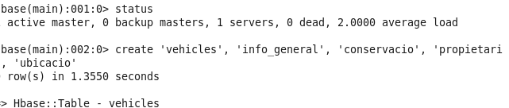

### Insereix mitjançant ordres put les tres primeres files de la taula.

```shell
put 'vehicles', '1', 'info_general:marca', 'Toyota'
put 'vehicles', '1', 'info_general:model', 'Corolla'
put 'vehicles', '1', 'info_general:matricula', '1234ABC'
put 'vehicles', '1', 'info_general:preu', '12000'
put 'vehicles', '1', 'conservacio:any', '2015'
put 'vehicles', '1', 'conservacio:km', '120000'
put 'vehicles', '1', 'conservacio:estat', 'bo'
put 'vehicles', '1', 'propietari:nif', '12345678A'
put 'vehicles', '1', 'propietari:nom', 'Joan Martínez'
put 'vehicles', '1', 'propietari:telefon', '623456789'
put 'vehicles', '1', 'propietari:mail', 'joan.martinez@email.com'
put 'vehicles', '1', 'ubicacio:ciutat', 'Palma'
put 'vehicles', '1', 'ubicacio:illa', 'Mallorca'
put 'vehicles', '1', 'ubicacio:longitud', '2.650160'
put 'vehicles', '1', 'ubicacio:latitud', '39.569600'

put 'vehicles', '2', 'info_general:marca', 'Ford'
put 'vehicles', '2', 'info_general:model', 'Focus'
put 'vehicles', '2', 'info_general:matricula', '5678DEF'
put 'vehicles', '2', 'info_general:preu', '15500'
put 'vehicles', '2', 'conservacio:any', '2018'
put 'vehicles', '2', 'conservacio:km', '55000'
put 'vehicles', '2', 'conservacio:estat', 'molt bo'
put 'vehicles', '2', 'propietari:nif', '87654321B'
put 'vehicles', '2', 'propietari:nom', 'Ana García'
put 'vehicles', '2', 'propietari:telefon', ''
put 'vehicles', '2', 'propietari:mail', 'ana.garcia@email.com'
put 'vehicles', '2', 'ubicacio:ciutat', 'Palma'
put 'vehicles', '2', 'ubicacio:illa', 'Mallorca'

put 'vehicles', '3', 'info_general:marca', 'Honda'
put 'vehicles', '3', 'info_general:model', 'Civic'
put 'vehicles', '3', 'info_general:matricula', '9012GHI'
put 'vehicles', '3', 'info_general:preu', '18000'
put 'vehicles', '3', 'conservacio:any', '2020'
put 'vehicles', '3', 'conservacio:km', '20000'
put 'vehicles', '3', 'conservacio:estat', 'bo'
put 'vehicles', '3', 'propietari:nif', '11223344C'
put 'vehicles', '3', 'propietari:nom', 'David López'
put 'vehicles', '3', 'propietari:telefon', '655123456'
put 'vehicles', '3', 'ubicacio:ciutat', 'Eivissa'
put 'vehicles', '3', 'ubicacio:illa', 'Eivissa'
put 'vehicles', '3', 'ubicacio:longitud', '1.452850'
put 'vehicles', '3', 'ubicacio:latitud', '38.916280'
```

```shell
scan 'vehicles'
```

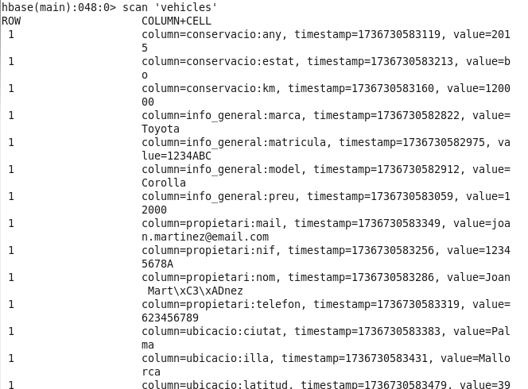

### Fes un fitxer CSV amb les 3 darreres files i carrega'l a la taula.

Cream un fitxer vehicles.csv amb les dades de les 3 darreres files.
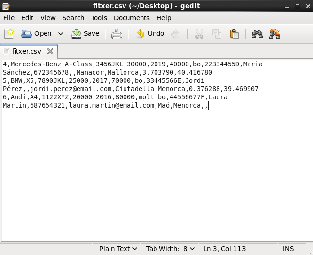


Copiam el fitxer al HDFS
```shell
hdfs dfs -put vehicles.csv /user/cloudera
```
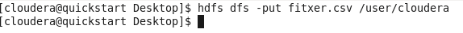

I ho importam amb la seguent comanda:

```shell
hbase org.apache.hadoop.hbase.mapreduce.ImportTsv -Dimporttsv.separator=',' \
-Dimporttsv.columns=HBASE_ROW_KEY,info_general:marca,info_general:model,info_general:matricula,info_general:preu,info_general:any,conservacio:km,conservacio:estat,propietari:nif,propietari:nom,propietari:telefon,propietari:mail,ubicacio:ciutat,ubicacio:illa,ubicacio:longitud,ubicacio:latitud \
vehicles \
hdfs:///user/cloudera/fitxer.csv
```

I ho verificam fent un scan:
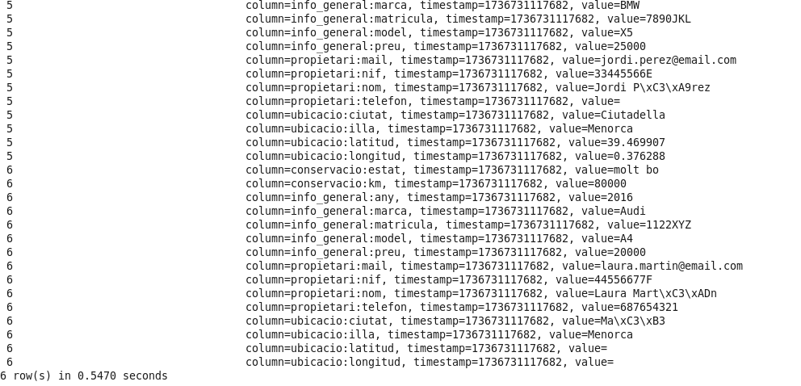

### Mostra totes les dades de la fila 4 amb un get.

```shell
get 'vehicles', '4'
```

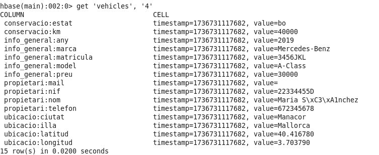

### Mostra les dades d'informació general de la taula amb un scan.

```shell
scan 'vehicles', {COLUMNS => 'info_general'}
```

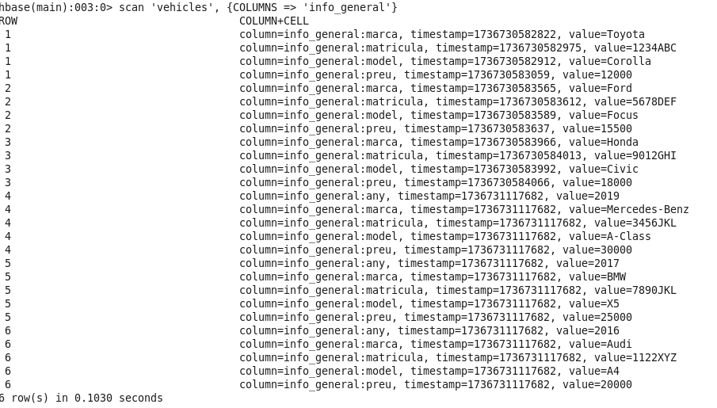

### Mostra totes les dades dels vehicles amb estat bo.

```shell
scan 'vehicles', {FILTER => "ValueFilter(=, 'binary:bo')"}
```
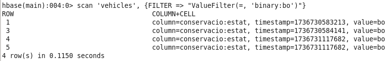

### Mostra les dades dels propietaris dels vehicles de Mallorca.

```shell
scan 'vehicles', {FILTER => "ValueFilter(=, 'substring:Mallorca')"}
```
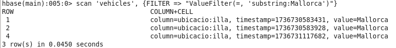

### Mostra la informació general dels vehicles que siguin posteriors al 2017 (inclòs) amb menys de 50000 km.

```shell
scan 'vehicles', {FILTER => "SingleColumnValueFilter('info_general', 'any', >=, 'binary:2017') AND SingleColumnValueFilter('conservacio', 'km', <, 'binary:50000')"}
```
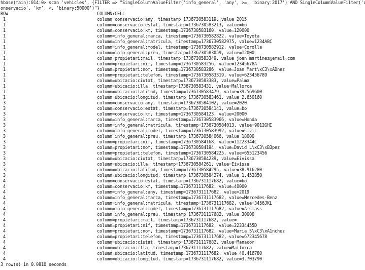

### Modifica la fila 2 i posa-li el telèfon 656123321

```shell
put 'vehicles', '2', 'propietari:telefon', '656123321'
```
Escaneja la taula per comprovar que s'ha fet el canvi.
```shell
scan 'vehicles'
```

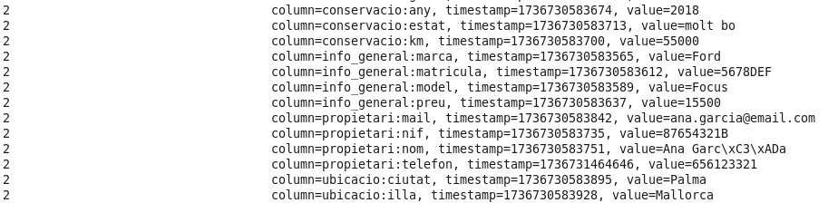

### Esborra totes les dades la fila 5.

```shell
deleteall 'vehicles', '5'
```
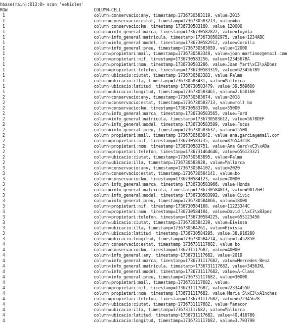
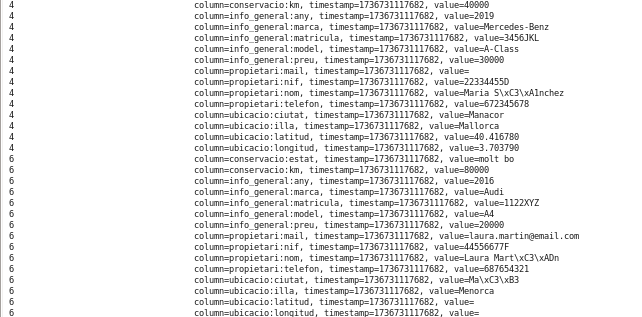

### Crea una taula externa en Hive vinculada a la taula vehicles d'HBase.
```sql
CREATE EXTERNAL TABLE vehicles (
  id string,
  marca string,
  model string,
  matricula string,
  preu int,
  any int,
  km int,
  estat string,
  nif string,
  nom string,
  telefon string,
  mail string,
  ciutat string,
  illa string,
  longitud double,
  latitud double
)
STORED BY 'org.apache.hadoop.hive.hbase.HBaseStorageHandler'
WITH SERDEPROPERTIES (
  "hbase.columns.mapping" = ":key,
  info_general:marca,
  info_general:model,
  info_general:matricula,
  info_general:preu,
  info_general:any,
  conservacio:km,
  conservacio:estat,
  propietari:nif,
  propietari:nom,
  propietari:telefon,
  propietari:mail,
  ubicacio:ciutat,
  ubicacio:illa,
  ubicacio:longitud,
  ubicacio:latitud"
)
TBLPROPERTIES("hbase.table.name" = "vehicles");
```

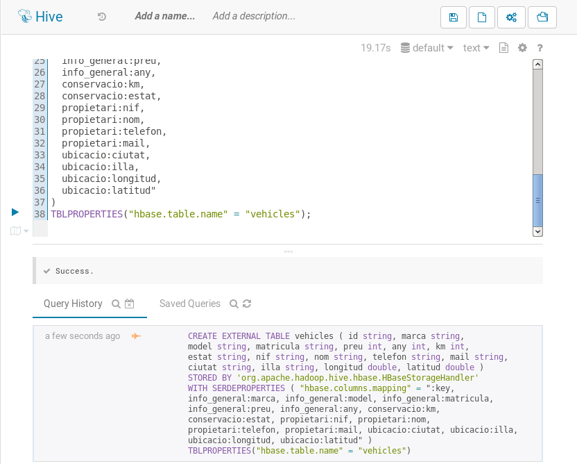
### Fes una consulta en HiveQL que retorni les dades d'informació general dels vehicles de Palma.

```sql
SELECT * FROM vehicles WHERE ciutat = 'Palma';
```
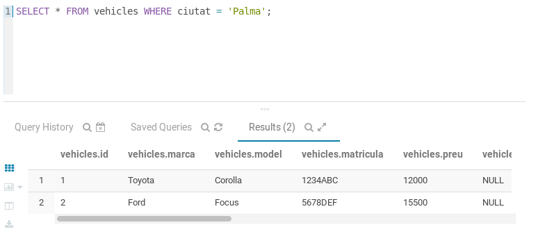

### Fes una consulta en Impala que retorni totes les dades dels 3 vehicles més cars.

```sql
SELECT * FROM vehicles ORDER BY preu DESC LIMIT 3;
```
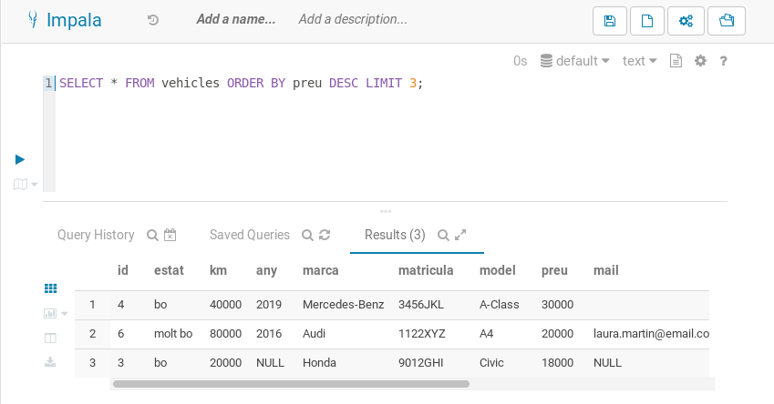

### Fes una consulta en HiveQL que agrupi els vehicles per estat i mostri la mitjana de km de cada estat.

```sql
SELECT estat, AVG(km) FROM vehicles GROUP BY estat;
```
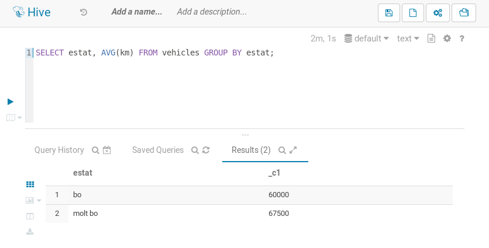

### Fes una consulta en Impala que agrupi els vehicles per illa i mostri el nombre de vehicles de cada illa.

```sql
SELECT illa, COUNT(*) FROM vehicles GROUP BY illa;
```
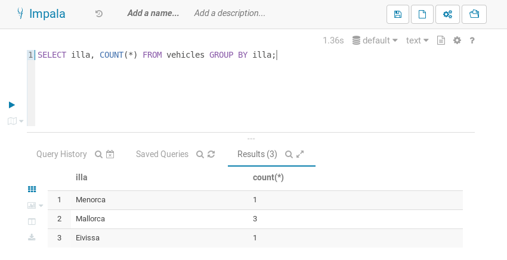

Fes un document de text on, per a cada un dels 15 apartats, aparegui l'ordre corresponent. En el cas de l'apartat 3, si fas servir l'eina gràfica per fer la importació, no cal.
Fes un document amb Word, Write o Docs on s'inclogui almenys una captura de pantalla que mostri l'execució de cada apartat. Exporta'l a PDF quan hagis acabat.
A continuació, fes un fitxer zip (o tar o tar.gz) que contengui els dos documents anteriors, a més del fitxer CSV que has carregat a l'apartat 3. El nom del fitxer ha de ser de la forma tasca_4_Nom_Llinatge.zip. Per exemple tasca_4_Toni_Navarrete.zip. No posis accents ni caràcters no anglesos (ç, ñ, etc.) i si tens espais en blanc, substitueix-los per guions baixos.
Finalment, envia el teu fitxer comprimit (amb el botó "Afegeix la tramesa").